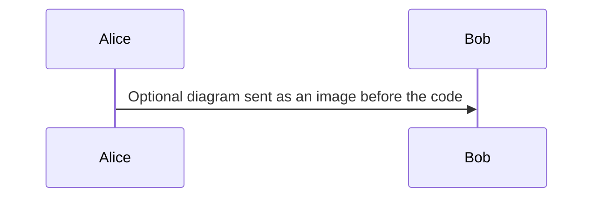
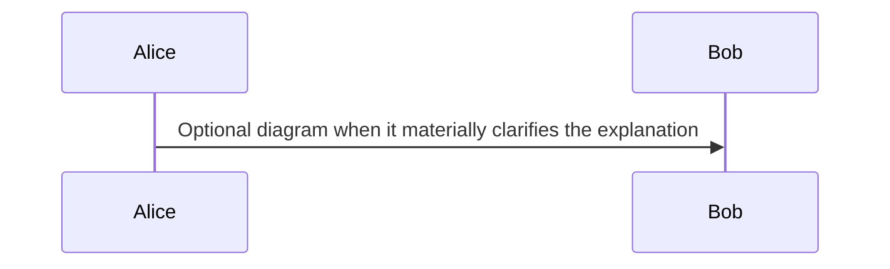

# Create an interview quiz

1. Choose exactly one lowercase topic directory and a lowercase kebab-case filename: `quizzes/java/read-write-lock-downgrade.md`. Never nest topics or use the reserved `-explain` suffix for a quiz. Always create or update its companion file alongside it: `quizzes/java/read-write-lock-downgrade-explain.md`.
2. Create the quiz Markdown file using this exact structure:

````markdown
---
id: java-example-question
status: draft
---

## Question

What is wrong with this code?

```java
// Optional supporting code. Telegram receives it as a separate message.
```



## Answers

a. First plausible answer.
b. Second plausible answer.
c. Third plausible answer.
d. Fourth plausible answer.

<!-- correct-answer: c -->

<details>
<summary>Answer explanation</summary>

Briefly explain why the selected answer is correct. Telegram displays this explanation after voting.

</details>
````

3. Create the companion `<slug>-explain.md` using this exact structure:

````markdown
# Descriptive explanation title

## Correct answer

c. Third plausible answer.

## Detailed explanation

Explain the underlying mechanism, relevant guarantees, failure modes, and practical tradeoffs.



## Code example

```java
// Include a practical, language-tagged code example.
```

## Why the other options are incorrect

- a. Explain why the first option is incorrect.
- b. Explain why the second option is incorrect.
- d. Explain why the fourth option is incorrect.
````

4. Use a globally unique lowercase kebab-case `id`; prefix it with the topic.
5. Keep the first question paragraph to 300 characters or fewer. Put code or additional context below that first paragraph; it is sent as a separate Telegram message.
6. Optionally include one fenced `mermaid` block inside `## Question` and at most one in the companion. Use valid Mermaid syntax such as `flowchart` or `sequenceDiagram`. Question diagrams are rendered through Mermaid Ink and sent as PNG images, so do not put secrets or private data in them.
7. Provide 2–12 single-line answers, each no longer than 100 characters. Label them consecutively `a.`, `b.`, `c.`, and so on.
8. Include exactly one `<!-- correct-answer: x -->` comment. Its lowercase letter must match an existing option. HTML comments are hidden in rendered Markdown, but remain visible in source.
9. Put a meaningful, concise answer explanation inside `<details>`. Its first paragraph becomes Telegram's short explanation; keep that paragraph within 200 characters where practical.
10. In the companion, copy the correct answer letter and text exactly, include a thorough explanation and at least one fenced code example with a language, and explain every incorrect answer in order using `- a. Explanation` bullets.
11. Write credible distractors of approximately equal length. Avoid making the correct answer consistently longer than the alternatives.
12. Never reset a `published` quiz to `draft`: the status records that its single publication attempt has already been reserved. Never treat its `-explain.md` companion as a publishable quiz.
13. Run `npm run validate` and `npm test` before finishing.
