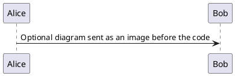

# Create an interview quiz

1. Choose exactly one lowercase topic directory and a lowercase kebab-case filename: `quizzes/java/read-write-lock-downgrade.md`. Never nest topics.
2. Create one Markdown file using this exact structure:

````markdown
---
id: java-example-question
status: draft
---

## Question

What is wrong with this code?

```java
// Optional supporting code. Telegram receives it as a separate message.
```



## Answers

a. First plausible answer.
b. Second plausible answer.
c. Third plausible answer.
d. Fourth plausible answer.

<!-- correct-answer: c -->

<details>
<summary>Answer explanation</summary>

Explain why the selected answer is correct and why the alternatives are wrong.

</details>
````

3. Use a globally unique lowercase kebab-case `id`; prefix it with the topic.
4. Keep the first question paragraph to 300 characters or fewer. Put code or additional context below that first paragraph; it is sent as a separate Telegram message.
5. Optionally include one fenced `plantuml` or `puml` block inside `## Question`. Start it with `@startuml` and end it with `@enduml`. Its source is sent to the public PlantUML Server for PNG rendering, so do not put secrets or private data in it.
6. Provide 2–12 single-line answers, each no longer than 100 characters. Label them consecutively `a.`, `b.`, `c.`, and so on.
7. Include exactly one `<!-- correct-answer: x -->` comment. Its lowercase letter must match an existing option. HTML comments are hidden in rendered Markdown, but remain visible in source.
8. Put a meaningful answer explanation inside `<details>`. Its first paragraph becomes Telegram's short explanation; keep that paragraph within 200 characters where practical. The remainder can contain a detailed analysis.
9. Write credible distractors of approximately equal length. Avoid making the correct answer consistently longer than the alternatives.
10. Never reset a `published` quiz to `draft`: the status records that its single publication attempt has already been reserved.
11. Run `npm run validate` and `npm test` before finishing.
