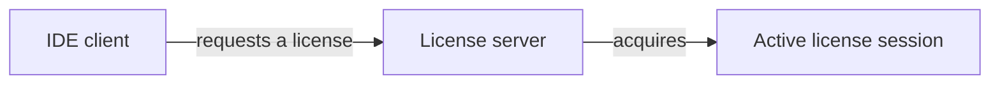
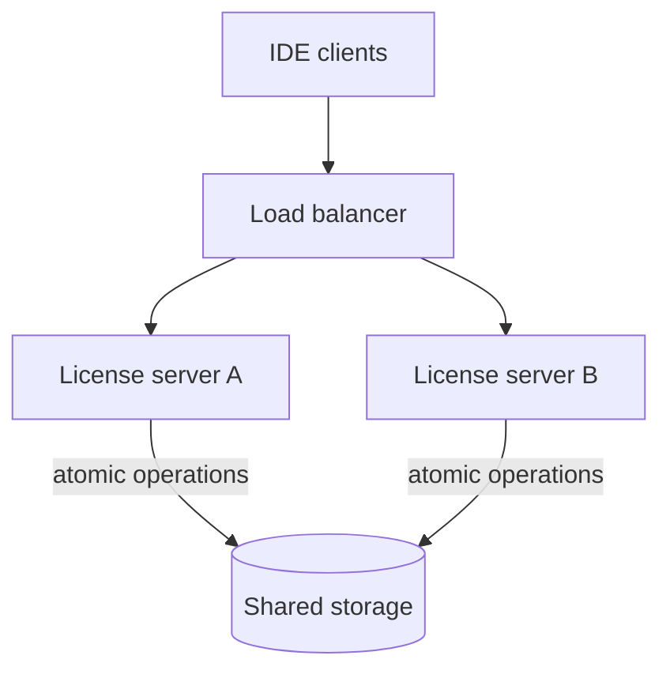

# Floating license server

<nav class="stage-navigation" aria-label="Lab stages">
  <strong>Stages</strong>
  <a href="#stage-1-build-a-single-process-license-server">1. Build</a>
  <a href="#stage-2-design-shared-storage">2. Scale</a>
</nav>

## Stage 1: Build a single-process license server

### Business task

Your company sells a software product that uses floating licenses. A customer owns a pool of `N` licenses shared by all of its users. A user may start the software only while a license is available, and each active user session consumes one license.

While the software is running, the client periodically sends a heartbeat. A heartbeat keeps the user's session active. If no heartbeat arrives within a configurable timeout, the session expires and its license becomes available to somebody else. A client may also explicitly release its license when it shuts down.

For this stage, a single Java process owns all state in memory.



> **A familiar example:** You have probably seen this while using IntelliJ IDEA at work: before the IDE starts, it obtains a floating license from your company's license server.

### Questions and requirements

- Implement the license server in Java.
- Never allow more than `N` active sessions, even when requests execute concurrently.
- Make obtaining a license idempotent: a user who already owns an active license succeeds without consuming another one.
- Renew only an existing, non-expired session.
- Release an active session once; repeated release must not increase capacity again.
- Decide when an expired session stops consuming capacity and becomes available again.
- Keep the timeout configurable and make time-dependent behavior testable without real sleeps.
- Add tests for normal behavior, expiry, idempotency, and concurrent attempts to obtain the last license.

### Hint

<details>
<summary>Show a suggested starting interface</summary>

```java
public interface LicenseServer {

    boolean obtainLicense(String userId);

    boolean releaseLicense(String userId);

    boolean pingLicense(String userId);
}
```

- `obtainLicense` returns `true` when the user already has an active license or receives a new one.
- `pingLicense` returns `true` only when an active session is renewed.
- `releaseLicense` returns `true` only when that call releases an active session.

</details>

[Next: Design shared storage →](#stage-2-design-shared-storage)

## Stage 2: Design shared storage

The service must now run as multiple instances. Any instance may handle any request, and instances may restart at any time. Process-local state and JVM locks can no longer coordinate allocation.



### Questions and requirements

- Which shared data store would you choose, and why does it fit this workload?
- How would you model pools, purchased capacity, users, active sessions, and expiry?
- Which atomic storage operation prevents two instances from allocating the final license?
- How does the design keep `active sessions <= N` without relying on a JVM lock or a count-then-insert race?
- How does repeated acquisition by the same user remain idempotent across instances?
- What happens when heartbeat races with expiry and reallocation?
- How do you prevent a delayed or repeated release from freeing a newly reassigned license?
- Which clock decides whether a session has expired?
- What happens if an instance crashes before or after committing an allocation?
- How would you test contention using at least two service instances connected to the same store?

### Hint

<details>
<summary>Think about it...</summary>

- Can purchased capacity be represented structurally instead of maintained as a counter?
- What must be locked, constrained, conditionally updated, or executed atomically when the last license is contested?
- How can a session identity distinguish a delayed heartbeat or release from the current owner?
- Can allocation itself recognize expired sessions so correctness does not depend on background cleanup?
- Which single source of time can every service instance trust for expiry decisions?

</details>

[← Previous: Build](#stage-1-build-a-single-process-license-server) · [Back to stages ↑](#floating-license-server)
