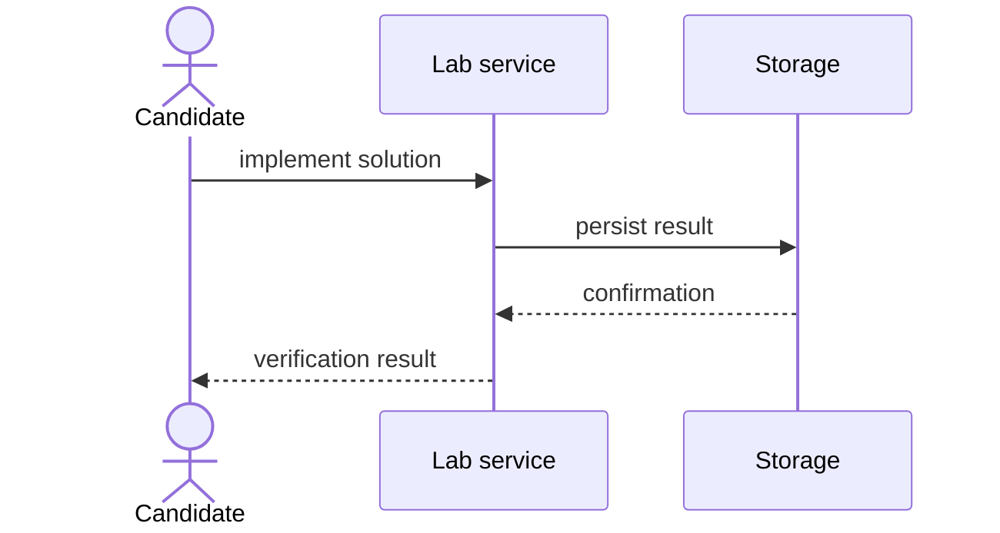

# Coding lab template

<nav class="stage-navigation" aria-label="Lab stages">
  <strong>Stages</strong>
  <a href="#stage-1-understand">1. Understand</a>
  <a href="#stage-2-implement">2. Implement</a>
  <a href="#stage-3-verify">3. Verify</a>
</nav>

## Stage 1: Understand

### Task description

Task description.

### Starting point

Here will be a code example:

```java
class CodingLabExample {
    // TODO: implement the solution.
}
```

[Next: Implement →](#stage-2-implement)

## Stage 2: Implement

### Requirements

Here will be implementation requirements, constraints, and acceptance criteria.

### Expected flow

Here will be a Mermaid diagram example:



[← Previous: Understand](#stage-1-understand) · [Next: Verify →](#stage-3-verify)

## Stage 3: Verify

### Verification

Here will be tests, edge cases, and review questions.

```java
// Here will be a test example.
```

[← Previous: Implement](#stage-2-implement) · [Back to stages ↑](#coding-lab-template)
