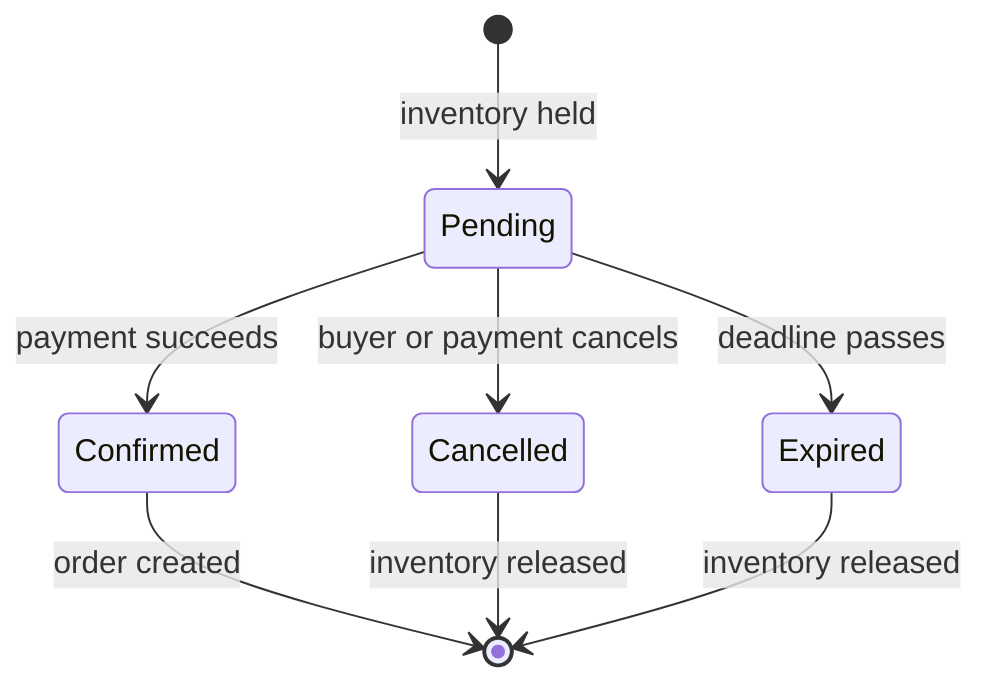
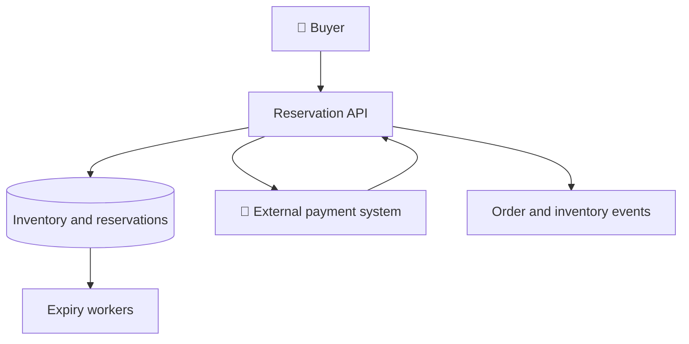
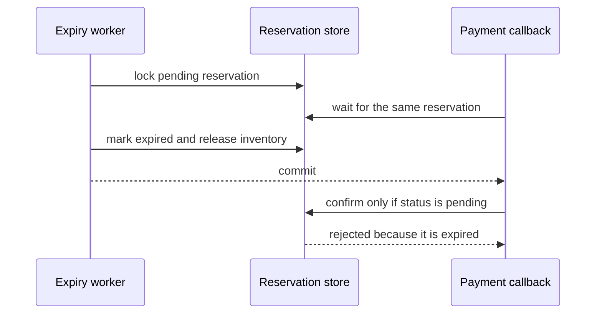

# Inventory reservations — Full solution

> 🚧 **Draft:** This solution is still being refined and may change.

This is one complete, correctness-first design. It is not the only valid answer: an interviewer may change the scale, the reservation window, or the meaning of availability and lead the discussion toward different trade-offs.

## Functional requirements

The core flow is deliberately small:

- A buyer can reserve one or more items for a limited payment window.
- The system rejects a reservation when there is not enough inventory.
- A successful external payment confirms the reservation and creates an order.
- A cancellation, failed payment, or timeout releases the reserved items.
- Repeated client requests and payment callbacks are idempotent.
- The buyer can inspect the current reservation state.

Catalog search, pricing, delivery, warehouse replenishment, and order fulfillment are outside the initial scope.

## Non-functional requirements

The central safety invariant is:

> For every item, `0 <= reserved <= onHand`. Inventory must never be oversold.

The design should also provide:

- low-latency reservation attempts during a spike of roughly 1,000 writes per second for one popular item;
- horizontal scaling for stateless request handling;
- durable and auditable reservation transitions;
- graceful retries after timeouts and duplicate delivery;
- eventual recovery of abandoned reservations after the 10-minute payment window.

Network partitions are unavoidable. Availability reads may be slightly stale, but inventory-changing requests favor consistency over availability: when the authoritative owner for an item cannot safely accept a write, the request fails or asks the buyer to retry rather than risking overselling.

## Sizing

For the supplied Black Friday spike:

```text
1,000 reservation attempts/s × 600 s = 600,000 attempts in 10 minutes
10,000 available units ÷ 1,000 attempts/s = 10 seconds to sell out at 100% success
10,000 active holds × about 1 KB/hold ≈ 10 MB of active hold data
```

The important distinction is between attempts and successful holds. A hot item may receive 600,000 attempts during the payment window, but only 10,000 one-unit holds can be active if it began with 10,000 units. Rejected attempts should not create durable reservation records unless the business needs an audit trail for them.

Across the whole shop, sizing must also include the number of active items, average lines per reservation, read traffic, event retention, and the ratio between ordinary and peak load. Those numbers decide when item ownership or storage must be partitioned.

## Entities, API, and high-level design

### Entities and lifecycle

The minimum durable model is:

- `ItemInventory(itemId, onHand, reserved, version)` — the authoritative quantity for an item;
- `Reservation(reservationId, buyerId, idempotencyKey, status, expiresAt)`;
- `ReservationLine(reservationId, itemId, quantity)`;
- `PaymentAttempt(providerPaymentId, reservationId, status)`;
- `Order(orderId, reservationId, status)`.

The reservation lifecycle is a guarded state machine. Only one terminal transition may win.



`expiresAt` is stored as data, not only as an in-memory timer. That lets another process recover the reservation after crashes or deployments.

### API

One possible HTTP surface is:

```http
POST /v1/reservations
Idempotency-Key: 692e56d8-77c2-4b23-a742-3bc25d5e6da8
Content-Type: application/json

{
  "items": [
    { "itemId": "item-42", "quantity": 2 }
  ]
}
```

Successful creation returns `201` with the reservation ID, status, and payment deadline. Replaying the same key with the same request returns the original result. Insufficient inventory returns `409`; temporary ownership or contention failures return a retryable response.

Additional operations:

```text
GET    /v1/reservations/{reservationId}
DELETE /v1/reservations/{reservationId}
POST   /v1/payment-events
```

The payment endpoint authenticates the external provider and deduplicates callbacks by the provider event or payment ID. The client never marks its own reservation as paid.

### High-level design



The API instances are stateless and scale horizontally. The authoritative store serializes conflicting transitions for the same inventory and reservation. Payment calls happen after the reservation transaction commits; no database lock is held while waiting for the external provider.

The normal flow is:

1. Atomically create a pending reservation and claim inventory.
2. Commit and return the payment deadline to the buyer.
3. Complete payment through the external provider.
4. Process the provider callback idempotently.
5. Atomically change `PENDING` to `CONFIRMED`, consume the held inventory, create the order, and record an outbox event.

## Data storage and atomicity

A relational primary store is a good starting point because the reservation state, its lines, and the inventory mutation can share one transaction. The simple implementation keeps one counter row per item.

For a single item, the reservation transaction can use a conditional update:

```sql
BEGIN;

INSERT INTO reservation (
    reservation_id, buyer_id, idempotency_key, status, expires_at
) VALUES (
    :reservation_id, :buyer_id, :idempotency_key, 'PENDING',
    CURRENT_TIMESTAMP + INTERVAL '10 minutes'
);

UPDATE item_inventory
SET reserved = reserved + :quantity,
    version = version + 1
WHERE item_id = :item_id
  AND on_hand - reserved >= :quantity;

-- Continue only when exactly one inventory row was updated.
INSERT INTO reservation_line (reservation_id, item_id, quantity)
VALUES (:reservation_id, :item_id, :quantity);

COMMIT;
```

If the conditional update affects zero rows, the transaction rolls back and reports insufficient inventory. The unique `(buyer_id, idempotency_key)` constraint makes a retry return the existing reservation instead of claiming inventory twice.

For a reservation with several items, lock or update item rows in ascending `itemId` order inside one short transaction. A global order prevents two carts containing the same items in opposite order from deadlocking repeatedly. If any line cannot be reserved, roll back the entire transaction.

Confirmation uses the same idea: lock the reservation row, verify that it is still `PENDING` and not expired, then perform the state transition and inventory updates in one transaction.

```sql
BEGIN;

SELECT status, expires_at
FROM reservation
WHERE reservation_id = :reservation_id
FOR UPDATE;

UPDATE reservation
SET status = 'CONFIRMED', confirmed_at = CURRENT_TIMESTAMP
WHERE reservation_id = :reservation_id
  AND status = 'PENDING'
  AND expires_at > CURRENT_TIMESTAMP;

UPDATE item_inventory AS i
SET on_hand = i.on_hand - l.quantity,
    reserved = i.reserved - l.quantity,
    version = i.version + 1
FROM reservation_line AS l
WHERE l.reservation_id = :reservation_id
  AND l.item_id = i.item_id;

INSERT INTO orders (order_id, reservation_id, status)
VALUES (:order_id, :reservation_id, 'CREATED');

INSERT INTO outbox (event_id, event_type, aggregate_id, payload)
VALUES (:event_id, 'OrderCreated', :order_id, :payload);

COMMIT;
```

Application code must check that the guarded reservation update changed exactly one row before applying the remaining statements. In production this can be a stored procedure, a transaction in the service, or a conditional statement chain with explicit row-count checks.

## Deep dives

### Hot-item contention

The counter-row model is correct, but every reservation for one popular item competes for the same row. At 1,000 writes per second, lock wait time and transaction duration can dominate throughput.

A scalable refinement represents a bounded amount of available inventory as independently lockable permit rows. A permit is logical capacity, not a serialized physical product.

```sql
BEGIN;

SELECT permit_id
FROM available_item_permit
WHERE item_id = :item_id
ORDER BY permit_id
LIMIT :quantity
FOR UPDATE SKIP LOCKED;

-- If exactly :quantity rows were obtained, delete them and create the hold.
DELETE FROM available_item_permit
WHERE item_id = :item_id
  AND permit_id IN (:claimed_permit_ids);

INSERT INTO reserved_item (
    reservation_id, item_id, quantity, expires_at
) VALUES (
    :reservation_id, :item_id, :quantity, :expires_at
);

COMMIT;
```

Different requests can lock different permit rows concurrently. Keep the transaction short and never call payment while the permits are locked.

There is an important semantic edge case: receiving fewer unlocked rows does not prove that inventory is exhausted. Other transactions may temporarily own the missing rows. The service should retry briefly with jitter, return a retryable busy result, or queue allocation. It must not report definitive out-of-stock solely from a short `SKIP LOCKED` result.

The pool may represent all currently available units for a 10,000-unit item, or a bounded working set replenished from the authoritative ledger. If it is bounded, only the refill slow path is serialized per item; ordinary claims remain parallel. Refill always rechecks authoritative stock after obtaining its coordination lock.

### Expiry racing with payment

Expiry workers scan an index on `(status, expiresAt)` and claim small batches. They lock the reservation row and apply the guarded transition `PENDING -> EXPIRED` in the same transaction that releases its inventory.



If the callback locks first, confirmation wins and the worker later sees a terminal state. If expiry wins, a late successful payment must not silently create an order against released inventory. The system records the late payment and asks the provider to void or refund it; an optional re-reservation is a separate business decision.

Worker delays do not extend the promise indefinitely. Every write checks the stored deadline using the authoritative store's clock. Lazy cleanup during a new reservation attempt can supplement background workers.

### Retries, delivery, and auditability

- A unique client idempotency key deduplicates reservation creation.
- A unique provider event ID deduplicates payment callbacks.
- Guarded state transitions make cancellation, payment, and expiry safe to retry.
- An outbox row is committed with each business transition and published asynchronously.
- Consumers deduplicate events by `eventId`; delivery is at least once.
- Every transition records actor, old state, new state, reason, and timestamp for support and reconciliation.

### Partitioning and multi-item reservations

Start with one transactional store and partition only when measurements require it. Item ID is a natural ownership key because contention and the invariant are per item. Each item has exactly one authoritative writer at a time.

After sharding, a cart may span several owners. Each owner creates an expiring sub-reservation locally. The coordinator confirms only after every item is held and releases completed sub-reservations when any claim fails. This saga preserves the no-oversell invariant per item, although the cart is not globally atomic during intermediate states. Idempotent commands and deadlines make recovery possible after coordinator failure.

### Observability and failure testing

Monitor:

- reservation latency, success, out-of-stock, busy, and retry rates;
- lock wait time, deadlocks, transaction duration, and permit-pool depth per hot item;
- expiry queue lag and the number of overdue pending reservations;
- duplicate and late payment callbacks, voids, and refunds;
- outbox backlog and consumer lag;
- invariant checks for negative counters or `reserved > onHand`.

Load tests should concentrate traffic on one item, not only distribute it evenly. Failure tests should crash workers before and after commits, delay payment callbacks beyond 10 minutes, redeliver every command, and run confirm/cancel/expire concurrently.

## Final design summary

The solution keeps one authoritative inventory owner per item, reserves inventory and records the hold atomically, treats payment as an external asynchronous operation, and resolves every terminal race with guarded state transitions. A simple conditional counter is the correct starting point. Independently lockable permits are an optimization for a measured hot-item bottleneck, not a replacement for the inventory ledger or business invariants.

Further reading: [Shopify inventory reservations](https://www.hellointerview.com/learn/system-design/in-the-wild/shopify-inventory-reservations).
