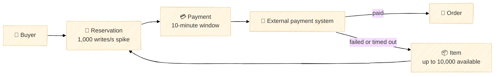
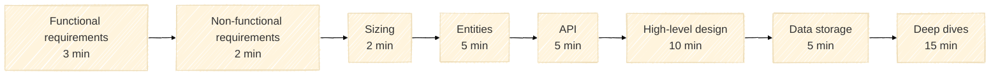

# Inventory reservations

<aside class="lab-prompt" aria-labelledby="inventory-design-prompt">
  <span class="lab-prompt-icon" aria-hidden="true">💡</span>
  <h2 id="inventory-design-prompt">Design an inventory reservation system</h2>
  <p>A large online shop must temporarily reserve items while a buyer pays through an external payment system. A successful payment turns the reservation into a purchase. A failed or timed-out payment makes the items available again.</p>
  <p>Many buyers may try to reserve the same popular item at once. Design a system that does not sell more items than exist, while avoiding unnecessary lost sales.</p>
</aside>



The numbers above are interview assumptions for a Black Friday spike, not a prescribed architecture. Ask the interviewer for any other constraint you need.

<nav class="stage-dot-navigation" aria-label="Lab stages" data-stage-navigation>
  <a href="#stage-1-functional-requirements-3-minutes" data-stage-link aria-label="Stage 1: Functional requirements" aria-current="step"><span aria-hidden="true">1</span><span class="stage-dot-tooltip">Functional requirements</span></a>
  <a href="#stage-2-non-functional-requirements-2-minutes" data-stage-link aria-label="Stage 2: Non-functional requirements"><span aria-hidden="true">2</span><span class="stage-dot-tooltip">Non-functional requirements</span></a>
  <a href="#stage-3-sizing-2-minutes" data-stage-link aria-label="Stage 3: Sizing"><span aria-hidden="true">3</span><span class="stage-dot-tooltip">Sizing</span></a>
  <a href="#stage-4-entities-5-minutes" data-stage-link aria-label="Stage 4: Entities"><span aria-hidden="true">4</span><span class="stage-dot-tooltip">Entities</span></a>
  <a href="#stage-5-api-5-minutes" data-stage-link aria-label="Stage 5: API"><span aria-hidden="true">5</span><span class="stage-dot-tooltip">API</span></a>
  <a href="#stage-6-high-level-design-10-minutes" data-stage-link aria-label="Stage 6: High-level design"><span aria-hidden="true">6</span><span class="stage-dot-tooltip">High-level design</span></a>
  <a href="#stage-7-data-storage-5-minutes" data-stage-link aria-label="Stage 7: Data storage"><span aria-hidden="true">7</span><span class="stage-dot-tooltip">Data storage</span></a>
  <a href="#stage-8-deep-dives-15-minutes" data-stage-link aria-label="Stage 8: Deep dives"><span aria-hidden="true">8</span><span class="stage-dot-tooltip">Deep dives</span></a>
</nav>

## Interview framework

<div class="framework-diagram" markdown="1">



</div>

Inspired by Hello Interview's [Delivery Framework](https://www.hellointerview.com/learn/system-design/in-a-hurry/delivery).

## Stage 1: Functional requirements (3 minutes)

Pick the few things the system really needs to do. Think about what the buyer can start, finish, cancel, or leave unfinished. Keep the list short so you have time to design the important path.

<div class="lab-workspace-heading">
  <label class="lab-workspace-label" for="functional-requirements">Your functional requirements</label>
  <button class="lab-copy-button" type="button" data-copy-lab-note data-copy-target="functional-requirements">Copy</button>
</div>
<textarea class="lab-workspace" id="functional-requirements" data-lab-stage-title="Functional requirements" rows="8" placeholder="Write 3–5 focused requirements and your clarifying questions…" spellcheck="true"></textarea>

<details markdown="1">
<summary>Show a format example from another system</summary>

For a photo-feed system, an interviewee might prioritize:

- A user can publish a photo.
- A user can follow another user.
- A user can view a feed of recent photos from followed users.

Notice that this example describes outcomes, not components or technologies.

</details>

[Next: Non-functional requirements →](#stage-2-non-functional-requirements-2-minutes)

## Stage 2: Non-functional requirements (2 minutes)

Use this step to understand the shape of the system. Will it need horizontal scaling? Is the traffic mostly reads or writes, and can one popular item become a write hotspot? During a network partition, should a request stay available or stop rather than risk inconsistent inventory? Network partitions can happen, so decide how the system should behave when they do.

<div class="lab-workspace-heading">
  <label class="lab-workspace-label" for="non-functional-requirements">Your non-functional requirements</label>
  <button class="lab-copy-button" type="button" data-copy-lab-note data-copy-target="non-functional-requirements">Copy</button>
</div>
<textarea class="lab-workspace" id="non-functional-requirements" data-lab-stage-title="Non-functional requirements" rows="8" placeholder="Write the main guarantees, targets, and trade-offs…" spellcheck="true"></textarea>

<details markdown="1">
<summary>Show a format example from another system</summary>

For a photo-feed system, an interviewee might say:

- Published photos must be durable.
- Feed reads should have p95 latency below 300 ms.
- The feed should remain available during a regional dependency failure.
- A short delay before a new photo appears in followers' feeds is acceptable.

</details>

[← Previous: Functional](#stage-1-functional-requirements-3-minutes) · [Next: Sizing →](#stage-3-sizing-2-minutes)

## Stage 3: Sizing (2 minutes)

Estimate only numbers that could change your design. A quick interview trick is to round everything to powers of ten. One day is roughly `10^5` seconds, so `10^8` daily operations are about `10^3` operations per second. The goal is a useful order of magnitude, not perfect arithmetic.

<div class="lab-workspace-heading">
  <label class="lab-workspace-label" for="sizing">Your sizing notes</label>
  <button class="lab-copy-button" type="button" data-copy-lab-note data-copy-target="sizing">Copy</button>
</div>
<textarea class="lab-workspace" id="sizing" data-lab-stage-title="Sizing" rows="8" placeholder="Record assumptions, quick calculations, and what they mean for the design…" spellcheck="true"></textarea>

<details markdown="1">
<summary>Show sizing examples from another system</summary>

Photo data:

```text
10^6 photos/day × 10^6 bytes/photo = 10^12 bytes/day ≈ 1 TB/day
```

Text data:

```text
10^8 messages/day × 10^3 bytes/message = 10^11 bytes/day ≈ 100 GB/day
10^8 messages/day ÷ 10^5 seconds/day   = 10^3 messages/s on average
10× peak                               = 10^4 messages/s at peak
```

The useful result is the order of magnitude and the design decision it affects.

</details>

[← Previous: Non-functional](#stage-2-non-functional-requirements-2-minutes)

## Stages 4–8: Design on the board (40 minutes)

<button class="lab-copy-summary-button" type="button" data-copy-lab-summary>Copy stages 1–3 for the board</button>

<div class="lab-design-flow" aria-label="Visual design stages">
  <section class="lab-design-step" id="stage-4-entities-5-minutes" data-stage-target="#stage-4-entities-5-minutes">
    <span>Stage 4 · 5 min</span>
    <strong>Entities</strong>
    <p>Draw the main business objects, their identities, states, and relationships.</p>
  </section>
  <span class="lab-design-arrow" aria-hidden="true">→</span>
  <section class="lab-design-step" id="stage-5-api-5-minutes" data-stage-target="#stage-5-api-5-minutes">
    <span>Stage 5 · 5 min</span>
    <strong>API</strong>
    <p>Add the operations, important request fields, responses, and business errors.</p>
  </section>
  <span class="lab-design-arrow" aria-hidden="true">→</span>
  <section class="lab-design-step" id="stage-6-high-level-design-10-minutes" data-stage-target="#stage-6-high-level-design-10-minutes">
    <span>Stage 6 · 10 min</span>
    <strong>High-level design</strong>
    <p>Connect the main components and walk through the success path and one failure.</p>
  </section>
  <span class="lab-design-arrow" aria-hidden="true">→</span>
  <section class="lab-design-step" id="stage-7-data-storage-5-minutes" data-stage-target="#stage-7-data-storage-5-minutes">
    <span>Stage 7 · 5 min</span>
    <strong>Data storage</strong>
    <p>Add records, keys, access patterns, lifecycle, and atomic state changes.</p>
  </section>
  <span class="lab-design-arrow" aria-hidden="true">→</span>
  <section class="lab-design-step" id="stage-8-deep-dives-15-minutes" data-stage-target="#stage-8-deep-dives-15-minutes">
    <span>Stage 8 · 15 min</span>
    <strong>Deep dives</strong>
    <p>Explore races, retries, hotspots, partial failures, recovery, and monitoring.</p>
  </section>
</div>

Paste your notes from stages 1–3 into the board, then develop the design from left to right. If embedding is restricted by your browser, [open Excalidraw in a new tab](https://excalidraw.com/).

<div class="lab-drawing-board" id="design-board">
  <iframe src="https://excalidraw.com/?embed=true&amp;theme=dark" title="Excalidraw inventory reservation design board" loading="lazy" allow="clipboard-read; clipboard-write" referrerpolicy="strict-origin-when-cross-origin"></iframe>
</div>

## Further reading after the interview

The exercise was inspired by [Shopify inventory reservations](https://www.hellointerview.com/learn/system-design/in-the-wild/shopify-inventory-reservations). Read it only after completing the lab if you want to compare your design with a production case study.
