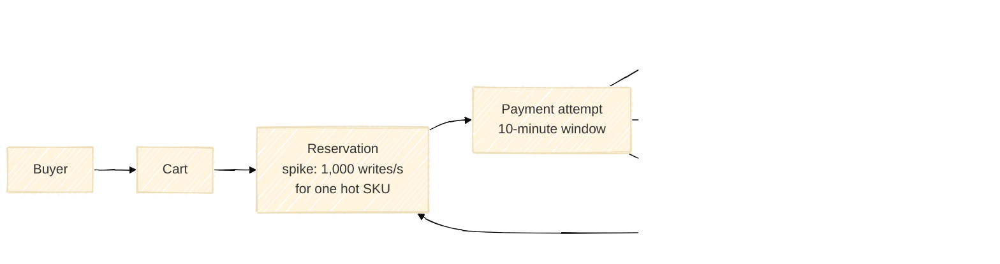
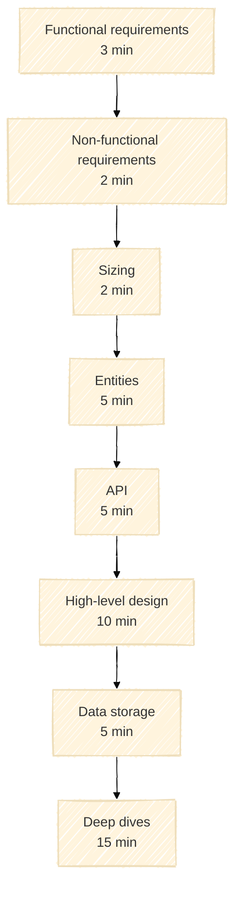
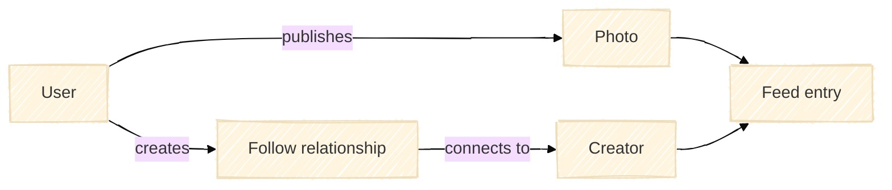
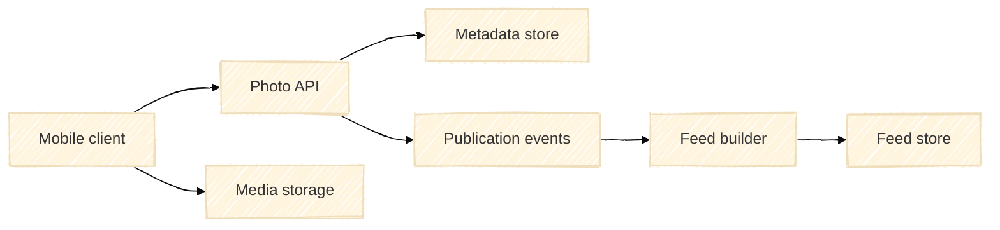
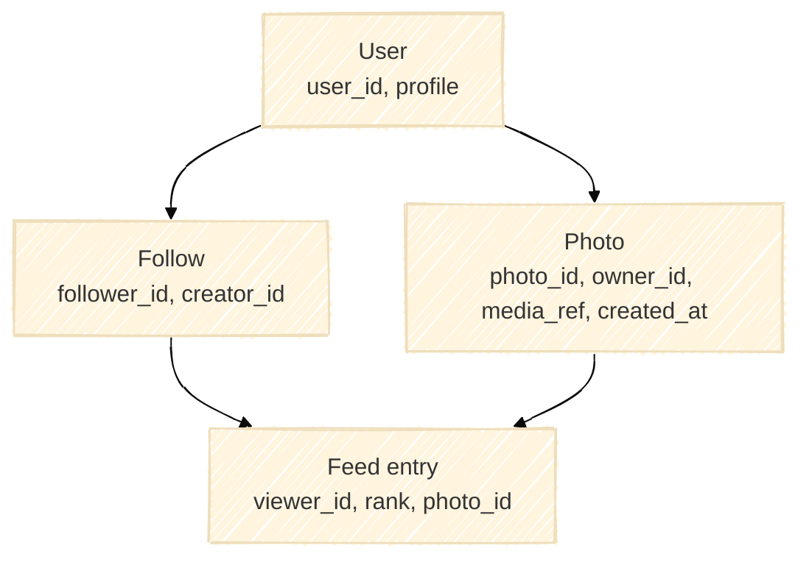
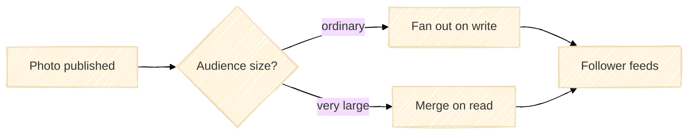

# Shopify inventory reservations

<aside class="lab-prompt" aria-labelledby="shopify-design-prompt">
  <span class="lab-prompt-icon" aria-hidden="true">💡</span>
  <h2 id="shopify-design-prompt">Design an inventory reservation system</h2>
  <p>A large e-commerce platform must temporarily reserve items while a buyer pays through an external payment system. A successful payment turns the reservation into a purchase. A failed or timed-out payment returns the items to sale.</p>
  <p>Many buyers may try to reserve the same popular SKU at once. Design a system that does not sell more items than exist, while avoiding unnecessary lost sales.</p>
</aside>



The numbers above are interview assumptions for a Black Friday spike, not prescribed architecture. Ask the interviewer for any other constraint you need.

## Interview framework



This lab uses its own framework, inspired by Hello Interview's [Delivery Framework](https://www.hellointerview.com/learn/system-design/in-a-hurry/delivery).

<nav class="stage-navigation" aria-label="Lab stages">
  <strong>Stages</strong>
  <a href="#stage-1-functional-requirements-3-minutes">1. Functional</a>
  <a href="#stage-2-non-functional-requirements-2-minutes">2. Non-functional</a>
  <a href="#stage-3-sizing-2-minutes">3. Sizing</a>
  <a href="#stage-4-entities-5-minutes">4. Entities</a>
  <a href="#stage-5-api-5-minutes">5. API</a>
  <a href="#stage-6-high-level-design-10-minutes">6. Design</a>
  <a href="#stage-7-data-storage-5-minutes">7. Storage</a>
  <a href="#stage-8-deep-dives-15-minutes">8. Deep dives</a>
</nav>

> The examples below demonstrate the expected **shape** of an answer using an unrelated photo-feed system. They are not answers to the inventory problem.

## Stage 1: Functional requirements (3 minutes)

Choose the small set of user-visible capabilities that the design must support. Clarify what starts, completes, cancels, and expires a business operation. Prioritize the core flow instead of listing every possible feature.

<label class="lab-workspace-label" for="functional-requirements">Your functional requirements</label>
<textarea class="lab-workspace" id="functional-requirements" rows="8" placeholder="Write 3–5 focused requirements and your clarifying questions…" spellcheck="true"></textarea>

<details markdown="1">
<summary>Show a format example from another system</summary>

For a photo-feed system, an interviewee might prioritize:

- A user can publish a photo.
- A user can follow another user.
- A user can view a feed of recent photos from followed users.

Notice that this example defines outcomes, not components or technologies.

</details>

[Next: Non-functional requirements →](#stage-2-non-functional-requirements-2-minutes)

## Stage 2: Non-functional requirements (2 minutes)

State the few qualities that will drive important design choices. Make them specific and measurable where possible. Explain which correctness, availability, latency, durability, and failure trade-offs matter most.

<label class="lab-workspace-label" for="non-functional-requirements">Your non-functional requirements</label>
<textarea class="lab-workspace" id="non-functional-requirements" rows="8" placeholder="Write the main guarantees, targets, and trade-offs…" spellcheck="true"></textarea>

<details markdown="1">
<summary>Show a format example from another system</summary>

For a photo-feed system, an interviewee might say:

- Published photos must be durable.
- Feed reads should have p95 latency below 300 ms.
- The feed should remain available during a regional dependency failure.
- A short delay before a new photo appears in followers' feeds is acceptable.

</details>

[← Previous: Functional](#stage-1-functional-requirements-3-minutes) · [Next: Sizing →](#stage-3-sizing-2-minutes)

## Stage 3: Sizing (2 minutes)

Estimate only the numbers that can change the design. Start with the supplied peak for one hot SKU, then identify missing traffic, data-volume, or retention assumptions. State the formula and round aggressively.

<label class="lab-workspace-label" for="sizing">Your sizing notes</label>
<textarea class="lab-workspace" id="sizing" rows="8" placeholder="Record assumptions, quick calculations, and the design consequence of each…" spellcheck="true"></textarea>

<details markdown="1">
<summary>Show a format example from another system</summary>

For a photo-feed system:

```text
20 million daily users × 20 feed loads/day ≈ 4,600 average reads/s
Assume a 10× peak                              ≈ 46,000 peak reads/s
2 million photos/day × 2 MB                    ≈ 4 TB/day of new media
```

The useful conclusion is not merely “the system is large”; it is which paths and data need independent scaling.

</details>

[← Previous: Non-functional](#stage-2-non-functional-requirements-2-minutes) · [Next: Entities →](#stage-4-entities-5-minutes)

## Stage 4: Entities (5 minutes)

Name the business entities, their identities, important states, and relationships. Keep this conceptual: do not choose tables, databases, queues, or cache keys yet.

<label class="lab-workspace-label" for="entities">Your entities and relationships</label>
<textarea class="lab-workspace" id="entities" rows="9" placeholder="List entities, important fields or states, and their relationships…" spellcheck="true"></textarea>

### Drawing board

Use the board for entities now and keep evolving the same sketch during high-level design and data storage. If embedding is restricted by your browser, [open Excalidraw in a new tab](https://excalidraw.com/).

<div class="lab-drawing-board" id="design-board">
  <iframe src="https://excalidraw.com/?embed=true&amp;theme=dark" title="Excalidraw system design board" loading="lazy" allow="clipboard-read; clipboard-write" referrerpolicy="strict-origin-when-cross-origin"></iframe>
</div>

<details markdown="1">
<summary>Show a sketch example from another system</summary>



</details>

[← Previous: Sizing](#stage-3-sizing-2-minutes) · [Next: API →](#stage-5-api-5-minutes)

## Stage 5: API (5 minutes)

Define the operations required by your functional requirements. Include identifiers, essential request and response fields, retry behavior, and business-level errors. Avoid exposing internal storage choices.

<label class="lab-workspace-label" for="api">Your API design</label>
<textarea class="lab-workspace" id="api" rows="11" placeholder="Describe endpoints or commands, payloads, responses, and error semantics…" spellcheck="true"></textarea>

<details markdown="1">
<summary>Show a format example from another system</summary>

```http
POST /v1/photos
Idempotency-Key: 01J...

{ "mediaUploadId": "upload-42", "caption": "Morning" }

201 Created
{ "photoId": "photo-91", "status": "PROCESSING" }
```

The example communicates a business operation, a stable identity, retry intent, and a meaningful state without exposing implementation details.

</details>

[← Previous: Entities](#stage-4-entities-5-minutes) · [Next: High-level design →](#stage-6-high-level-design-10-minutes)

## Stage 6: High-level design (10 minutes)

Draw the end-to-end path for the core flow. Show component responsibilities, system boundaries, and the important synchronous and asynchronous interactions. Walk through success first, then one failure path.

<label class="lab-workspace-label" for="high-level-design">Your high-level design notes</label>
<textarea class="lab-workspace" id="high-level-design" rows="9" placeholder="Explain the request path, component responsibilities, and failure boundaries…" spellcheck="true"></textarea>

[Continue in the embedded drawing board ↑](#design-board)

<details markdown="1">
<summary>Show a sketch example from another system</summary>



</details>

[← Previous: API](#stage-5-api-5-minutes) · [Next: Data storage →](#stage-7-data-storage-5-minutes)

## Stage 7: Data storage (5 minutes)

Choose how each entity and state transition is represented. Discuss access patterns, indexes or partition keys, lifecycle and retention, and which changes must be atomic. Technology names are useful only after the required behavior is clear.

<label class="lab-workspace-label" for="data-storage">Your data-storage design</label>
<textarea class="lab-workspace" id="data-storage" rows="11" placeholder="Describe records, keys, indexes, state transitions, and atomic boundaries…" spellcheck="true"></textarea>

[Continue in the embedded drawing board ↑](#design-board)

<details markdown="1">
<summary>Show a sketch example from another system</summary>



</details>

[← Previous: High-level design](#stage-6-high-level-design-10-minutes) · [Next: Deep dives →](#stage-8-deep-dives-15-minutes)

## Stage 8: Deep dives (15 minutes)

Let the interviewer choose one or two risky areas. Trace concurrent requests and partial failures step by step. Defend the invariant, identify the bottleneck at the given spike, and explain monitoring, recovery, and trade-offs.

Consider asking which area to explore rather than trying to cover everything.

<label class="lab-workspace-label" for="deep-dives">Your deep-dive analysis</label>
<textarea class="lab-workspace" id="deep-dives" rows="13" placeholder="Work through races, retries, failures, hotspots, recovery, and observability…" spellcheck="true"></textarea>

<details markdown="1">
<summary>Show a format example from another system</summary>

For a photo-feed system, useful deep dives might include celebrity fan-out, duplicate event delivery, deletion propagation, and rebuilding a user's feed after data loss.



The candidate would pick one branch, state its trade-off, and test it against failures and the earlier requirements.

</details>

[← Previous: Data storage](#stage-7-data-storage-5-minutes) · [Back to framework ↑](#interview-framework)

## Further reading after the interview

The exercise was inspired by [Shopify inventory reservations](https://www.hellointerview.com/learn/system-design/in-the-wild/shopify-inventory-reservations). Read it only after completing the lab if you want to compare your design with a production case study.
