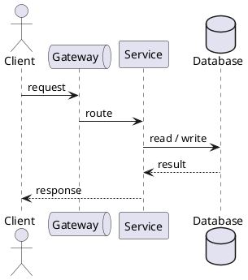

# Design lab template

<nav class="stage-navigation" aria-label="Lab stages">
  <strong>Stages</strong>
  <a href="#stage-1-frame-the-problem">1. Frame</a>
  <a href="#stage-2-design">2. Design</a>
  <a href="#stage-3-evaluate">3. Evaluate</a>
</nav>

## Stage 1: Frame the problem

### Task description

Task description.

### Context

Here will be requirements, scale assumptions, and constraints.

[Next: Design →](#stage-2-design)

## Stage 2: Design

### Proposed architecture

Here will be a PlantUML diagram example:



### Configuration or schema

Here will be a code example:

```yaml
service:
  replicas: 3
  timeout: 500ms
```

[← Previous: Frame](#stage-1-frame-the-problem) · [Next: Evaluate →](#stage-3-evaluate)

## Stage 3: Evaluate

### Trade-offs and failure modes

Here will be design trade-offs, bottlenecks, failure scenarios, and follow-up questions.

[← Previous: Design](#stage-2-design) · [Back to stages ↑](#design-lab-template)
