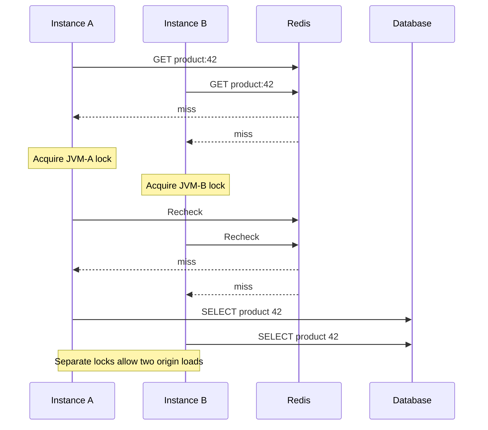

# Why JVM-local single-flight still allows a fleet cache stampede

## Correct answer

d. Two reads occur; use a fleet-wide per-key lease, then recheck Redis inside the lease.

## Detailed explanation

A process-local single-flight lock coordinates callers only inside one JVM. Instance A and instance B own different lock objects, so both can become the leader for the same cache key. The stated timing makes both initial Redis reads miss and prevents either database load from finishing before the other instance rechecks Redis. Both rechecks therefore miss, and both instances start a database read.

With more service instances, the same design can produce one origin load per instance for a hot key. It still reduces amplification within each process, but it does not collapse work across the fleet.

To guarantee one database read under the stated no-failure and lease-duration assumptions, coordinate with a shared per-key lease:

1. Read Redis normally.
2. On a miss, acquire the lease for that cache key.
3. Recheck Redis after acquiring the lease, because another holder may have populated it.
4. Only the holder that still sees a miss loads the database and populates Redis.
5. Release the lease using an ownership token; waiters retry Redis after release.

The second cache check is essential. Without it, a waiter can acquire the lease after the first holder populated Redis and still perform another database read. A production lease also needs an expiry and ownership-safe release. If a holder can outlive its lease, stronger fencing or acceptance of occasional duplicate loads is required; those failures are explicitly excluded from this quiz.

TTL jitter is useful for spreading expirations of many different keys, but it cannot elect one loader after this particular hot key is already absent.



## Code example

```java
final class CacheAsideLoader {
    private final SharedCache cache;
    private final Origin origin;
    private final SingleFlightCoordinator coordinator;

    String get(String key) {
        return cache.get(key).orElseGet(() ->
            coordinator.execute(key, () ->
                cache.get(key).orElseGet(() -> {
                    String loaded = origin.load(key);
                    cache.put(key, loaded);
                    return loaded;
                })));
    }
}
```

The algorithm works fleet-wide only when `SingleFlightCoordinator` is backed by shared coordination, such as an ownership-token lease in Redis. Passing a separate in-memory coordinator to every JVM reproduces the two-load problem. The runnable module forces both instances through the initial miss and verifies both configurations deterministically.

## Why the other options are incorrect

- a. A process-local lock is not stored in Redis and cannot be observed or acquired by another service instance.
- b. TTL jitter spreads expiration times across keys; it does not coordinate loaders after this hot key is already missing.
- c. Redis processes the GET commands, but serial command execution does not turn repeated misses into a fleet-wide lock.
