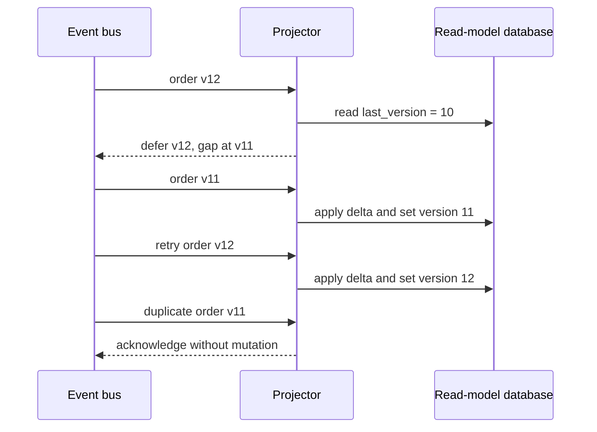

# Handling out-of-order CQRS projection events

## Correct answer

c. Atomically apply only `last_version + 1`; ignore old duplicates and retry gaps.

## Detailed explanation

The aggregate version is a deterministic ordering key. Because every event is a delta, the projector may apply version `n` only when the stored projection is at version `n - 1`. The state change and advance of `last_version` must happen in one database transaction.

For the first v12 delivery, the stored version is 10, so version 11 is missing. The projector performs no mutation and defers or negatively acknowledges v12. When v11 arrives, it applies and advances the row to 11. A retry of v12 can then apply and advance the row to 12.

Any later event whose version is less than or equal to `last_version` is a duplicate or stale delivery and is acknowledged without applying its delta again. A row lock or conditional write must make the check-and-update atomic when multiple workers can process the same aggregate concurrently.

This rule deliberately stops progress for an aggregate when an event is truly missing. Production systems need monitoring and a repair path—such as replaying the aggregate stream or rebuilding its projection—rather than silently skipping the gap.



## Code example

```java
@Transactional
public void project(OrderEvent event) {
    OrderView view = repository.findByIdForUpdate(event.orderId())
        .orElseThrow();

    if (event.version() <= view.lastVersion()) {
        return; // Duplicate or stale delivery.
    }

    long expected = view.lastVersion() + 1;
    if (event.version() != expected) {
        throw new ProjectionGapException(expected, event.version());
    }

    view.apply(event);
    view.setLastVersion(event.version());
    repository.save(view);
}
```

The listener acknowledges only after this transaction commits. A `ProjectionGapException` must follow a configured defer, retry, or repair path; repeatedly retrying forever without alerting would hide a permanently missing event.

## Why the other options are incorrect

- a. Accepting any greater version lets v12 advance the row to 12 before v11. The later v11 is then treated as stale, so its delta is lost permanently.
- b. Timestamps can tie, skew, or reflect production rather than aggregate order. A fixed buffer also cannot prove that all earlier events have arrived.
- d. Arrival order is exactly the unreliable order in the scenario. A nightly rebuild leaves the read model wrong for hours and does not make online projection correct.
