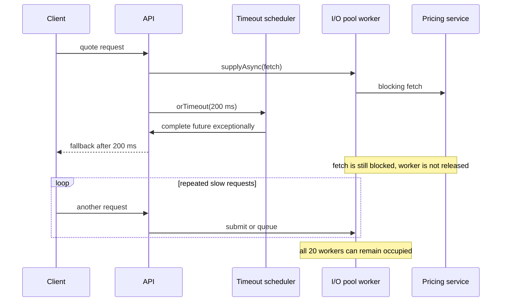

# CompletableFuture timeouts and exhausted worker pools

## Correct answer

a. orTimeout completes the future, but the blocking supplier can keep its pool worker occupied.

## Detailed explanation

CompletableFuture.orTimeout(...) arranges for the future to complete exceptionally with TimeoutException if it is still incomplete when the deadline expires. That changes what dependent stages and the caller observe. It does not impose a timeout on the socket operation inside pricingClient.fetch(...), and it does not interrupt a supplier that is already running.

The exceptionally(...) stage can therefore produce Quote.unavailable() after about 200 ms while the worker remains blocked for seconds or indefinitely. After twenty slow calls, every fixed-pool worker can be occupied. Later requests are queued instead of starting useful work, so the application has bounded response latency but no bounded resource usage.

Executors.newFixedThreadPool(20) also uses an unbounded LinkedBlockingQueue. That avoids immediate rejection, but it permits a backlog during overload. Futures that time out before their queued suppliers start may later become no-ops when dequeued, yet they still consume queue memory and scheduling work until the executor reaches them.



The primary timeout must be applied where blocking occurs: configure connection, request, and read deadlines in the downstream client so fetch actually returns. A bounded executor queue and explicit rejection policy add bulkhead isolation and backpressure. The CompletableFuture timeout can remain as an outer end-to-end deadline, but it is not a substitute for cancelling or bounding the underlying operation.

Cancellation is also not a universal fix. Calling cancel(true) on a CompletableFuture does not guarantee interruption of the supplier, and many I/O libraries need their own cancellation or timeout mechanism. The design must verify how the concrete client releases sockets, threads, and connection-pool leases.

## Code example

```java
private final ThreadPoolExecutor ioPool = new ThreadPoolExecutor(
    20,
    20,
    0L,
    TimeUnit.MILLISECONDS,
    new ArrayBlockingQueue<>(100),
    new ThreadPoolExecutor.AbortPolicy()
);

CompletionStage<Quote> quote(QuoteRequest request) {
    try {
        return CompletableFuture
            .supplyAsync(
                () -> pricingClient.fetch(
                    request,
                    Duration.ofMillis(150) // timeout enforced by the I/O client
                ),
                ioPool
            )
            .orTimeout(200, TimeUnit.MILLISECONDS) // outer request deadline
            .exceptionally(error -> Quote.unavailable());
    } catch (RejectedExecutionException overloaded) {
        return CompletableFuture.completedFuture(Quote.unavailable());
    }
}
```

Here the downstream client must guarantee that its 150 ms deadline releases the connection and returns the worker. The bounded queue caps pending work, while rejection turns excess load into an immediate fallback instead of an ever-growing backlog.

## Why the other options are incorrect

- b. orTimeout does not interrupt the supplier. The exceptionally stage normally runs on the thread that completes the future and is not the reason the blocking I/O worker remains occupied.
- c. A fixed thread pool does not replace timed-out workers or grow beyond twenty threads. The problem is that its existing workers stay busy while new tasks accumulate in the queue.
- d. The future completes exceptionally at the deadline, which allows exceptionally to return the fallback. The mismatch is between future completion and the lifetime of the underlying task.
