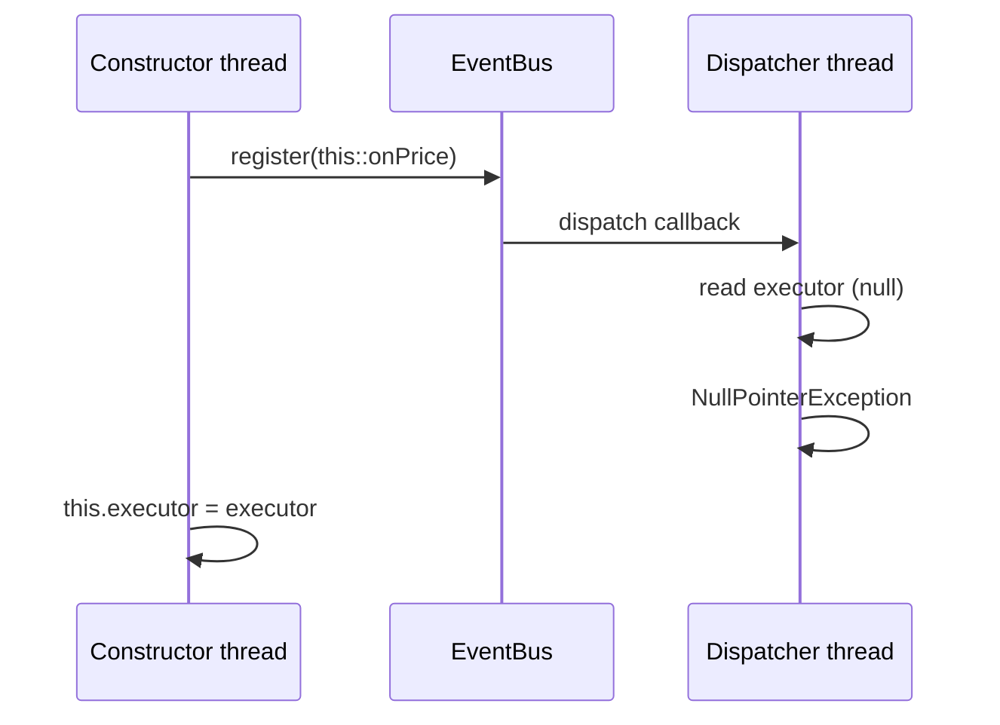

# Constructor escape through listener registration

## Correct answer

d. A callback may see executor as null because this escapes before assignment completes.

## Detailed explanation

The expression `this::onPrice` creates a bound method reference whose receiver is the new `PriceCache`. Passing it to `events.register(...)` exposes that receiver while the constructor is still running. If registration stores the listener where a dispatcher thread can reach it, that thread may invoke `onPrice` before the constructor assigns `executor`.

In the concrete execution below, the callback reads the field while it still contains Java's default value, `null`, so `executor.execute(...)` throws `NullPointerException`. This is not merely a stale-read argument: the callback can genuinely run before the assignment in program order.

The `final` modifier does not delay access to the object. Final-field initialization guarantees apply when the constructor finishes normally and the reference does not escape during construction. Publishing `this` from the constructor forfeits the intended safe-initialization boundary for code that obtains the early reference.



A common reason for this design is convenience: the object becomes subscribed as soon as it is created. The safer design separates construction from registration. A factory can finish all field assignments first and only then publish the listener through a thread-safe event-bus operation.

The `ConcurrentHashMap` protects concurrent map operations, but it cannot make the surrounding object's construction safe. Safe publication is an object-lifecycle concern, independent of the collection chosen for one field.

## Code example

```java
final class PriceCache {
    private final ConcurrentMap<String, BigDecimal> prices =
        new ConcurrentHashMap<>();
    private final Executor executor;

    private PriceCache(Executor executor) {
        this.executor = Objects.requireNonNull(executor);
    }

    static PriceCache create(EventBus events, Executor executor) {
        PriceCache cache = new PriceCache(executor);
        events.register(cache::onPrice); // construction has completed
        return cache;
    }

    private void onPrice(PriceChanged event) {
        executor.execute(() ->
            prices.put(event.symbol(), event.price()));
    }
}
```

This relies on `EventBus.register` safely publishing registered listeners to its dispatcher threads, as a concurrent event bus should. Another valid approach is for composition-root code to construct the cache and register it in two explicit steps.

## Why the other options are incorrect

- a. `ConcurrentHashMap` supports concurrent updates; listener registration does not turn its operations into unsynchronized `HashMap` access.
- b. A bound method reference retains its receiver, so the listener keeps the `PriceCache` reachable rather than discarding it.
- c. Final-field semantics do not postpone method invocation; a leaked reference can be used while the constructor is still executing.
