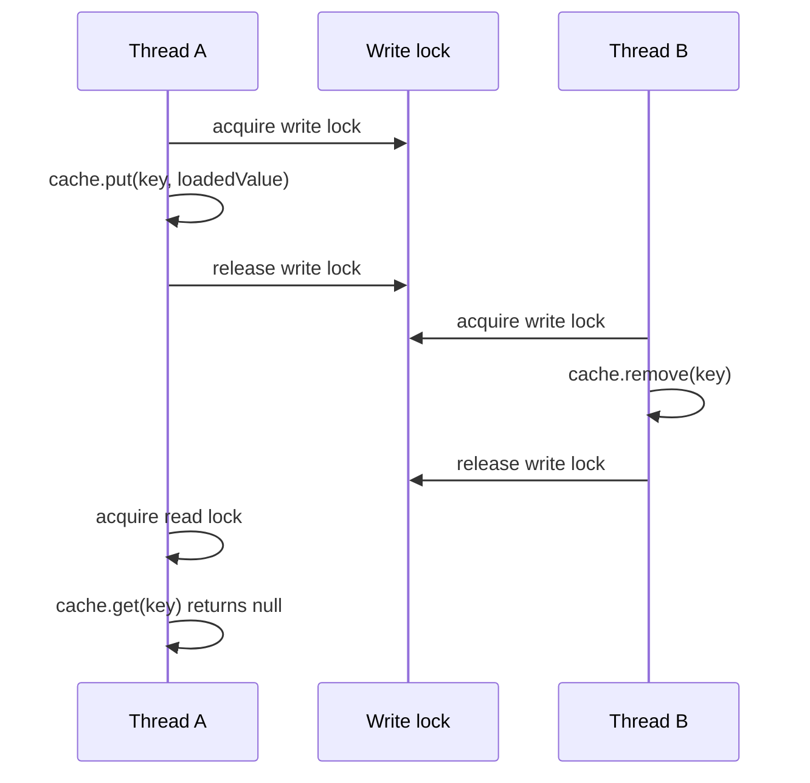

# Read-write lock downgrading and cache consistency

## Correct answer

c. Another writer can modify the cache between lock operations.

## Detailed explanation

`ReentrantReadWriteLock` permits many concurrent readers or one exclusive writer. Unlocking the write lock before acquiring the read lock creates an unprotected interval: another writer can acquire the write lock, replace the entry, or remove it before the original thread reads the cache.

The individual cache operations remain synchronized, but the larger operation does not. The method can therefore load one value and return a different value, return `null` after an intervening removal, or observe an invalidated entry.



The fix is lock downgrading: acquire the read lock while still holding the write lock, then release the write lock. The current thread now continues under a read lock without leaving any interval in which another writer can intervene. `ReentrantReadWriteLock` supports this direction; upgrading directly from a read lock to a write lock is not generally safe.

A complete cache implementation often reads optimistically first, releases the read lock before requesting the write lock, checks again after obtaining the write lock, and finally downgrades before reading the result. The second check is necessary because another writer may have populated the cache while the locks were being switched.

## Code example

```java
String getOrLoad(String key) {
    lock.readLock().lock();

    if (!cache.containsKey(key)) {
        lock.readLock().unlock();
        lock.writeLock().lock();

        try {
            if (!cache.containsKey(key)) {
                cache.put(key, load(key));
            }

            // Downgrade before releasing exclusive access.
            lock.readLock().lock();
        } finally {
            lock.writeLock().unlock();
        }
    }

    try {
        return cache.get(key);
    } finally {
        lock.readLock().unlock();
    }
}
```

## Why the other options are incorrect

- a. Acquiring a read lock after releasing a write lock does not inherently deadlock; the actual problem is the unprotected interval between them.
- b. `containsKey()` is protected by the exclusive write lock, so the lookup itself is synchronized correctly.
- d. Java evaluates the return expression before executing `finally`, so the read happens while the read lock is still held.
