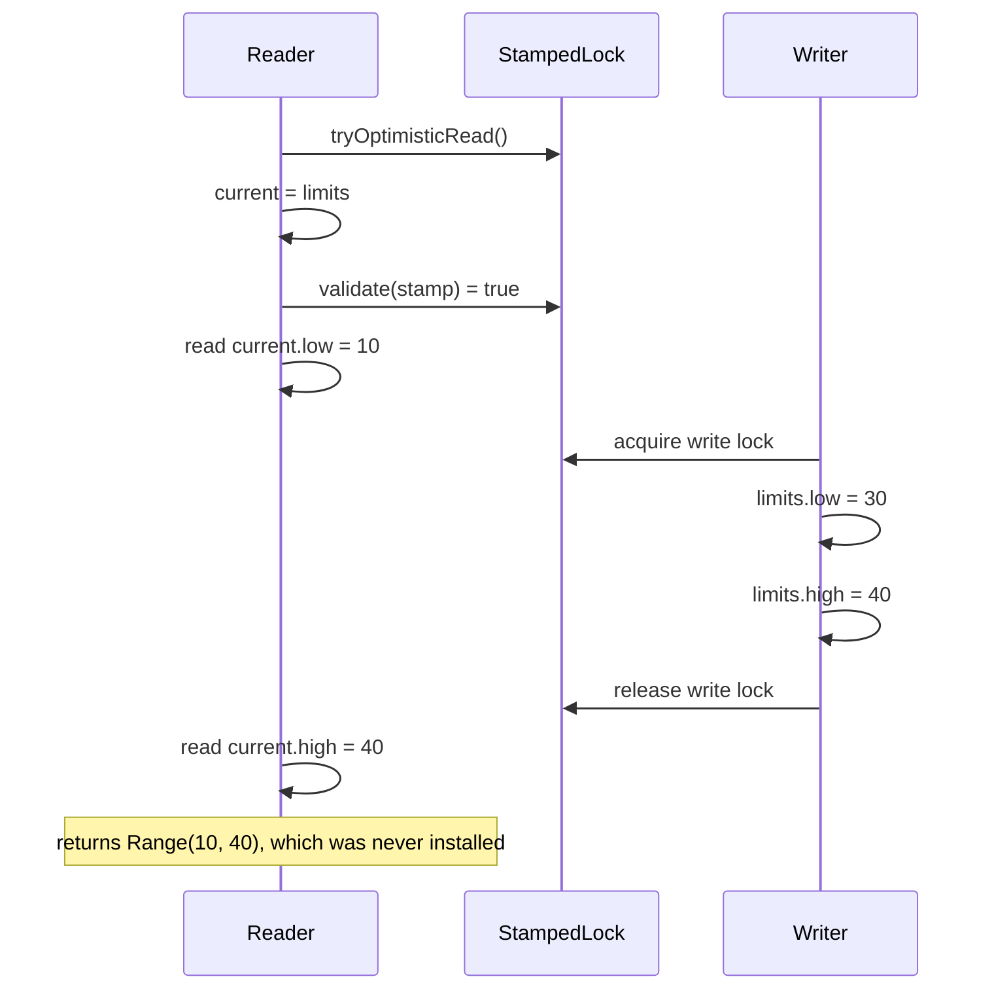

# StampedLock optimistic reads and mutable snapshots

## Correct answer

b. Validation covers the reference read, but the fields are copied after protection has ended.

## Detailed explanation

A `StampedLock` optimistic read does not lock anything. The intended pattern is to read every value that belongs to the snapshot, then call `validate(stamp)`. If validation succeeds, no writer acquired the write lock between the optimistic stamp and those reads. If it fails, the reader must repeat all snapshot reads while holding a read lock.

The broken method reads only the `limits` reference before validation. That reference always points to the same mutable object, so validating it proves little. The actual state reads, `current.low` and `current.high`, happen later, after validation and outside any read lock.

The fallback has the same flaw. It acquires a read lock but copies only the reference, releases the lock, and then reads the mutable fields. A writer can therefore update the fields between the two reads. For example, the reader can observe the old `low` and the new `high`, even though that pair was never installed by one call to `update`.



The fix is to copy the primitive fields while the optimistic stamp is still being checked. If validation fails, both fields must be copied again while holding the read lock. Returning an immutable object that writers replace atomically can also simplify the design, but its publication guarantees still need to be explicit.

## Code example

```java
Range currentRange() {
    long stamp = lock.tryOptimisticRead();
    int low = limits.low;
    int high = limits.high;

    if (!lock.validate(stamp)) {
        stamp = lock.readLock();
        try {
            low = limits.low;
            high = limits.high;
        } finally {
            lock.unlockRead(stamp);
        }
    }

    return new Range(low, high);
}
```

Here the optimistic path reads the complete candidate snapshot before validation. A successful validation confirms that no write-lock acquisition overlapped those reads. The fallback copies the complete snapshot before releasing the read lock.

## Why the other options are incorrect

- a. An optimistic stamp excludes no writer. Its value is useful only when every relevant read occurs before a successful validation.
- c. `validate` checks whether a write-lock acquisition invalidated the stamp; it neither consumes the stamp nor resets fields to default values.
- d. Unlocking a read lock does not write the local reference into shared state. The problem is reading mutable fields after the lock is gone.
