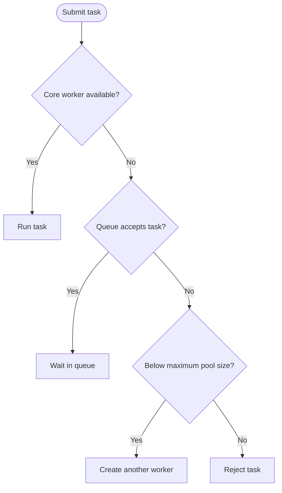

# Choosing blocking queues for thread pools

## Correct answer

c. The linked queue absorbs bursts, while the array queue limits backlog and memory use.

## Detailed explanation

`ThreadPoolExecutor` first creates workers up to `corePoolSize`. Once the core workers are busy, it tries to enqueue each new task. Only when the queue refuses a task does the executor create additional workers up to `maximumPoolSize`; once both the queue and worker pool are full, its rejection handler runs.

A no-argument `LinkedBlockingQueue` has an effective capacity of `Integer.MAX_VALUE`. This makes it suitable for background work that should tolerate short bursts, but a producer that consistently outpaces consumers can build an enormous backlog and eventually exhaust heap memory. Because the queue keeps accepting work, `maximumPoolSize` normally has no practical effect after the core workers exist.

`ArrayBlockingQueue<>(100)` limits the backlog to 100 queued tasks. Once the queue fills, the executor can grow from its four core workers toward its maximum of sixteen. If all workers are busy and the queue remains full, `AbortPolicy` throws `RejectedExecutionException`; the caller can return `false`, apply backpressure, or report overload.

The implementations also have different mechanical tradeoffs. `LinkedBlockingQueue` allocates a node for each enqueued task and uses separate locks for insertion and removal. `ArrayBlockingQueue` allocates its backing array upfront, uses one lock for both operations, and can optionally enforce fair acquisition. The choice should primarily follow workload and overload behavior, then be confirmed with measurements.



## Code example

```java
ExecutorService backgroundPool = new ThreadPoolExecutor(
    4, 4,
    0L, TimeUnit.SECONDS,
    new LinkedBlockingQueue<>()
);

ExecutorService requestPool = new ThreadPoolExecutor(
    4, 16,
    30L, TimeUnit.SECONDS,
    new ArrayBlockingQueue<>(100),
    new ThreadPoolExecutor.AbortPolicy()
);

boolean trySubmitRequest(Runnable request) {
    try {
        requestPool.execute(request);
        return true;
    } catch (RejectedExecutionException overloaded) {
        return false;
    }
}
```

## Why the other options are incorrect

- a. Both queues are FIFO by default; neither implementation automatically assigns task priority.
- b. The bounded array queue can permit growth beyond the core size, but an unbounded linked queue does not create one worker per task.
- d. Both classes implement `BlockingQueue`; whether an empty queue blocks or returns `null` depends on the method called, not on the implementation.
