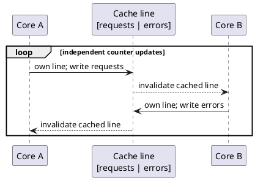

# Volatile counters and false sharing

## Correct answer

a. The fields may share a cache line, so each write invalidates the other core's cached copy.

## Detailed explanation

The two counters are logically independent and each has only one writer, so this example does not lose increments. The call to `Thread.join()` also establishes the visibility needed by the thread that later reads the final values. Correctness, however, does not guarantee good multicore performance.

Processors move memory through cache lines rather than individual Java fields. If `requests` and `errors` occupy the same cache line, a core must obtain ownership of that line before writing its counter. Its write invalidates the other core's copy. The other core then requests ownership to update the adjacent counter, invalidating the first copy. This cache-coherence ping-pong is false sharing: the threads share a physical cache line without intentionally sharing data.



`volatile` makes every update visible and constrains reordering, which increases the frequency with which the coherence protocol sees these writes. It does not use one JVM-wide monitor. The precise impact depends on object layout, CPU architecture, JVM options, and workload, so it should be confirmed with a JMH benchmark and hardware performance counters rather than inferred from timing one loop.

Common remedies are to separate hot writable state, reduce the frequency of shared writes through local aggregation, or use contention-friendly counters such as `LongAdder`. `@Contended` can isolate fields in controlled low-level code, but using this internal annotation for application classes requires JVM configuration and should be justified by measurements.

## Code example

```java
import java.util.concurrent.atomic.LongAdder;

final class Metrics {
    private final LongAdder requests = new LongAdder();
    private final LongAdder errors = new LongAdder();

    void recordRequest() {
        requests.increment();
    }

    void recordError() {
        errors.increment();
    }

    long requestCount() {
        return requests.sum();
    }

    long errorCount() {
        return errors.sum();
    }
}
```

`LongAdder` spreads updates across internal cells under contention and combines them when `sum()` is requested. It is well suited to statistics where reads need an aggregate value but do not require a linearizable snapshot at every instant.

## Why the other options are incorrect

- b. A volatile access uses memory-ordering and visibility guarantees, not one global JVM monitor shared by every volatile field.
- c. Reads and writes of a volatile `long` are atomic; because each field has one writer here, the increments are not lost or retried due to tearing.
- d. `join()` waits for a worker to terminate and creates a happens-before relationship after termination; it does not run inside or synchronize every loop iteration.
