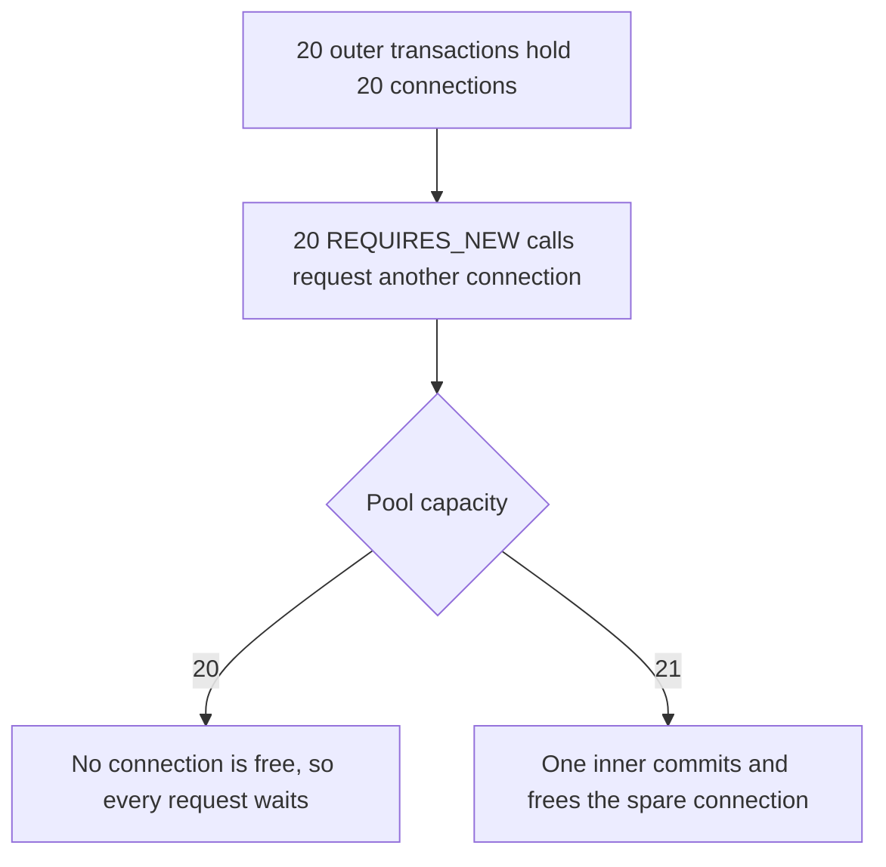

# Avoiding REQUIRES_NEW connection-pool starvation

## Correct answer

d. One extra connection lets inners complete sequentially, so 21 connections are the minimum.

## Detailed explanation

`PROPAGATION_REQUIRES_NEW` suspends the outer transaction's transaction context, but it does not make the outer transaction's JDBC connection available for unrelated work. The outer connection remains associated with that suspended transaction. The inner transaction is independent and therefore needs another connection from the same pool.

After all 20 outer transactions have executed SQL, the 20-connection pool has no free connection. Every request then waits for an inner connection. None can reach its outer commit and release an outer connection, so the system makes no progress under the stated no-timeout assumption.

With a pool size of 21, one inner transaction can acquire the spare connection, commit, and return it. The pool can then grant that connection to another waiter. Repeating this process lets every request finish, so 21 is the mathematical minimum for this deliberately closed scenario.

This is a lower bound, not a production sizing recommendation. Other request paths, database administration, health checks, and deeper nesting require additional capacity. A better design may remove the nested independent transaction—for example, by writing an audit or outbox row in the outer transaction and processing it asynchronously.



## Code example

```java
@Service
final class OrderService {
    private final JdbcTemplate jdbc;
    private final AuditService audit;

    @Transactional
    public void place(long orderId) {
        jdbc.update("insert into orders(id) values (?)", orderId);
        audit.record(orderId);
    }
}

@Service
final class AuditService {
    private final JdbcTemplate jdbc;

    @Transactional(propagation = Propagation.REQUIRES_NEW)
    public void record(long orderId) {
        jdbc.update("insert into order_audit(order_id) values (?)", orderId);
    }
}
```

When many outer calls reach `audit.record` together, each outer transaction retains its connection while the inner method asks for another. If independent audit durability is not required, joining the outer transaction avoids the second connection. If it is required, size the pool for the nesting pattern and monitor acquisition waits and timeouts.

## Why the other options are incorrect

- a. Transaction suspension pauses the outer work but leaves its resources bound to it; the outer connection is not returned for the inner transaction to borrow.
- b. Reusing the same physical connection would not create an independent transaction while the outer transaction remains suspended.
- c. Forty connections allow every inner transaction to run simultaneously, but simultaneous execution is unnecessary for progress. One spare connection is sufficient under the stated assumptions.
