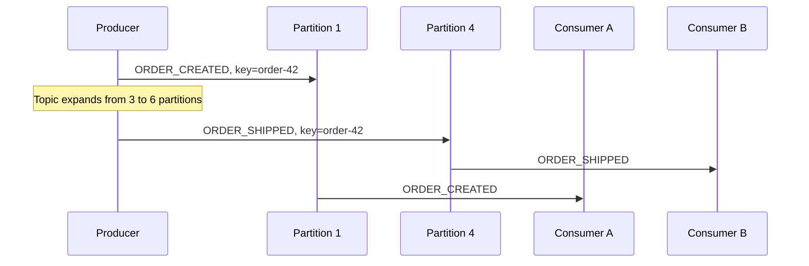

# Kafka partition expansion and message ordering

## Correct answer

d. Messages with the same key may no longer remain ordered.

## Detailed explanation

Kafka guarantees record order within an individual partition. It does not establish a global order across partitions, even when records carry the same logical key. Producers typically choose a partition using a hash of the key and the topic's current partition count.

For example, if a key has an illustrative hash value of 10, it maps to partition 1 when the topic has three partitions because `10 % 3 = 1`. After expanding the same topic to six partitions, the key maps to partition 4 because `10 % 6 = 4`. Real producer implementations may use a different hash function, but changing the partition count can still change the selected partition.

Existing records stay in their original partition. New records can arrive in the newly selected partition and be processed by a different consumer. If that consumer advances faster, a later event such as `ORDER_SHIPPED` can be observed before an older `ORDER_CREATED` record from the original partition.



When ordering is a business requirement, choose a partition count with sufficient headroom, coordinate a migration to a new topic, temporarily stop producers and drain existing records before changing the routing scheme, or include per-entity sequence numbers so consumers can detect and correct out-of-order delivery.

## Code example

```java
String key = "order-42";

producer.send(new ProducerRecord<>(
    "orders", key, "ORDER_CREATED"
));

// An administrator increases the topic from 3 to 6 partitions.
// The producer refreshes its metadata and may select another partition.

producer.send(new ProducerRecord<>(
    "orders", key, "ORDER_SHIPPED"
));

// Illustrative partition selection:
int keyHash = 10;
int oldPartition = keyHash % 3; // 1
int newPartition = keyHash % 6; // 4
```

## Why the other options are incorrect

- a. Increasing the partition count does not automatically move existing records; they remain in their original partitions.
- b. Kafka clients refresh metadata and consumer groups rebalance; consumers do not inherently require a manual restart.
- c. Partition count and replication factor are separate settings; adding partitions does not automatically raise replication.
