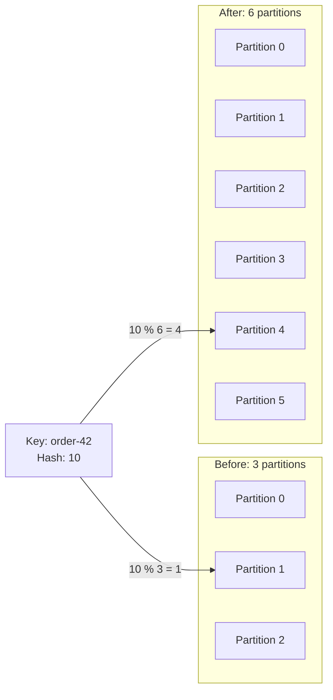

## Question

What can happen when a Kafka topic grows from 3 to 6 partitions?

## Answers

a. Existing messages are redistributed across all six partitions.
b. Consumers must restart before reading the new partitions.
c. The replication factor automatically increases to six.
d. Messages with the same key may no longer remain ordered.

<!-- correct-answer: d -->

Answer explanation

Increasing the partition count can remap a key to another partition. Old and new messages may then reside in different partitions, where Kafka does not guarantee their relative ordering.

