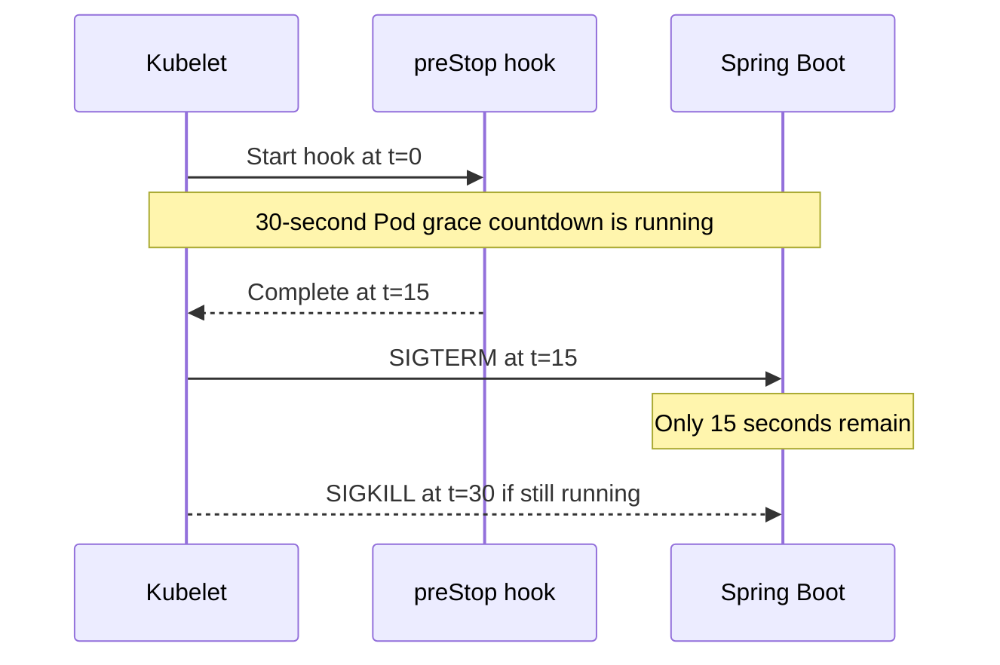

# Budgeting Kubernetes preStop and Spring graceful shutdown

## Correct answer

a. The app gets 15 s; set the Pod grace period to at least 40 s, plus operational margin.

## Detailed explanation

`terminationGracePeriodSeconds` is one end-to-end termination budget. Its countdown begins before Kubernetes invokes the container's `preStop` hook. Kubernetes waits for that hook to finish and only then asks the container runtime to send SIGTERM to process 1.

Under the stated exact timings, the sequence is:

1. At 0 seconds, Pod termination and its 30-second grace countdown begin.
2. The `preStop` hook sleeps for 15 seconds.
3. At 15 seconds, the container receives SIGTERM and Spring begins graceful shutdown.
4. At 30 seconds, the Pod grace period expires, so a still-running process is forcibly terminated.

Spring therefore receives only 15 seconds of its requested 25-second window. A request that legitimately needs between 15 and 25 seconds to finish can be interrupted even though both settings look reasonable in isolation.

The minimum budget under these exact assumptions is `15 + 25 = 40` seconds. Production timing is not exact, so configure additional margin; the fixed example uses 45 seconds. Also ensure the application runs as the signal-receiving process and that traffic draining is coordinated, but neither concern changes this time-budget calculation.



## Code example

```yaml
apiVersion: v1
kind: Pod
metadata:
  name: checkout
spec:
  terminationGracePeriodSeconds: 45
  containers:
    - name: checkout
      image: checkout:example
      env:
        - name: SPRING_LIFECYCLE_TIMEOUT_PER_SHUTDOWN_PHASE
          value: 25s
      lifecycle:
        preStop:
          exec:
            command: ["sh", "-c", "sleep 15"]
```

This configuration leaves 30 seconds after the hook: 25 seconds for Spring's configured shutdown phase and 5 seconds of margin. The runnable project loads both the problematic and fixed Pod specifications and verifies their budgets.

## Why the other options are incorrect

- b. The Pod grace countdown begins before `preStop`; the hook does not receive a separate, uncounted window.
- c. SIGTERM starts Spring shutdown, but it does not reset or extend Kubernetes' already-running Pod grace period.
- d. Readiness controls whether a Pod receives regular Service traffic; it does not extend the termination deadline.
