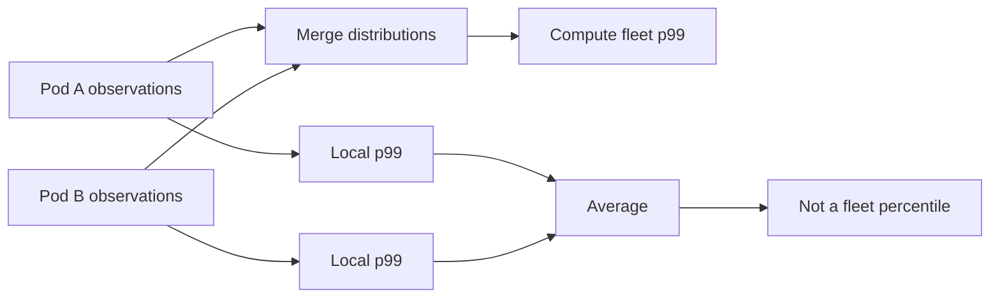

# Why pod-level p99 values cannot be averaged

## Correct answer

b. The gauges are insufficient; merge request observations first, then compute the fleet p99.

## Detailed explanation

A percentile is an order statistic, not a value that can be added or averaged. A pod's p99 says where one rank falls inside that pod, but it does not describe how the other observations are distributed. Multiplying local p99 values by request counts does not restore the discarded observations.

Consider two pods using the nearest-rank definition:

- Pod A records 99 requests at 10 ms and one request at 1,000 ms. Its p99 is 10 ms.
- Pod B records 100 requests at 20 ms. Its p99 is 20 ms.
- Their count-weighted local p99 is 15 ms.
- The merged fleet has 200 requests. Rank `ceil(0.99 * 200) = 198` is 20 ms, so its p99 is 20 ms.

Taking the maximum local p99 happens to return 20 ms for this dataset, but it is not a general aggregation rule. A lightly loaded pod can have a very high local p99 without contributing enough requests to affect the fleet p99, while many moderately slow observations spread across pods can determine the fleet tail.

For an exact fleet percentile, merge the request observations or a lossless mergeable distribution and calculate the percentile once. Production monitoring normally uses identically configured histograms or mergeable sketches to control cost; their result can be approximate, so bucket boundaries or error guarantees must match the SLO.



## Code example

```java
static long nearestRank(List<Long> samples, double quantile) {
    long[] sorted = samples.stream().mapToLong(Long::longValue).sorted().toArray();
    int index = (int) Math.ceil(quantile * sorted.length) - 1;
    return sorted[index];
}

List<Long> podA = new ArrayList<>(Collections.nCopies(99, 10L));
podA.add(1_000L);
List<Long> podB = Collections.nCopies(100, 20L);

List<Long> fleet = Stream.concat(podA.stream(), podB.stream()).toList();
long fleetP99 = nearestRank(fleet, 0.99); // 20 ms
```

The production equivalent is to aggregate compatible histogram buckets or mergeable distribution state across instances before evaluating the service-level quantile. Averaging already calculated quantiles cannot reconstruct the missing ranks.

## Why the other options are incorrect

- a. Counts supply weights, but each local p99 still represents only one rank and omits the rest of the latency distribution.
- c. The maximum overweights a slow, low-traffic pod and can also miss a fleet percentile formed by observations spread across several pods.
- d. Equal traffic does not make percentiles linear; identical sample counts still do not reveal the observations around each local rank.
