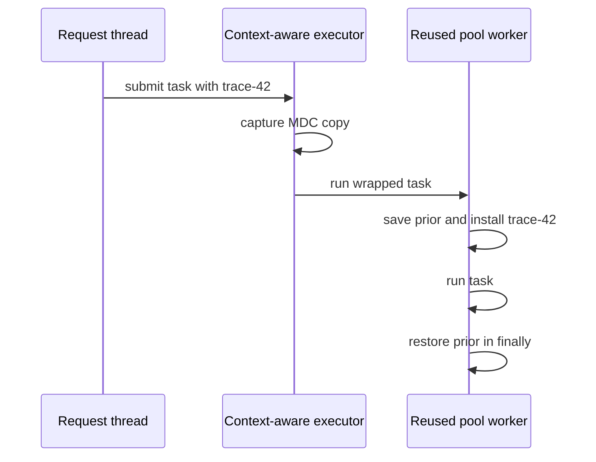

# Propagating MDC safely across pooled tasks

## Correct answer

a. Capture at submission, install on the worker, then restore its prior context in `finally`.

## Detailed explanation

An MDC backed by `ThreadLocal` stores a different context for each thread. Setting `traceId` on an HTTP request thread therefore does not set it on a pool worker. Because executor threads are reused, any value left on a worker can also appear in an unrelated later task.

The context must be copied when the task is submitted, not when it eventually starts: the request may already have completed and cleared its MDC by then. The wrapper saves the worker's current context, installs the captured copy, runs the task, and restores the saved context in a `finally` block. Restoration must happen even if the task throws.

Restoring rather than merely clearing also makes the wrapper composable. If an outer framework scope already installed worker context, the executor returns to that exact state after the nested task.

In production, prefer the propagation facility supplied by the chosen tracing or observability library when one exists. The required contract is the same: capture at the handoff boundary, activate for the task's scope, and close or restore the scope reliably.



## Code example

```java
final class MdcExecutor implements Executor {
    private final Executor delegate;

    MdcExecutor(Executor delegate) {
        this.delegate = delegate;
    }

    @Override
    public void execute(Runnable task) {
        Map<String, String> captured = MDC.getCopyOfContextMap();

        delegate.execute(() -> {
            Map<String, String> previous = MDC.getCopyOfContextMap();
            try {
                replaceMdc(captured);
                task.run();
            } finally {
                replaceMdc(previous);
            }
        });
    }

    private static void replaceMdc(Map<String, String> context) {
        if (context == null) {
            MDC.clear();
        } else {
            MDC.setContextMap(context);
        }
    }
}
```

The captured and previous maps are copies. A task cannot mutate the submitting thread's MDC, and the next task cannot observe context left by this wrapper.

## Why the other options are incorrect

- b. `InheritableThreadLocal` copies state when a child thread is created. Existing pool workers are not recreated for each request, so later request values are not inherited safely.
- c. `volatile` provides visibility for one shared value; it does not associate a different value with each submitting request or task.
- d. Setting context after submission races with task execution and still changes only the request thread's MDC, not the worker's per-thread map.
