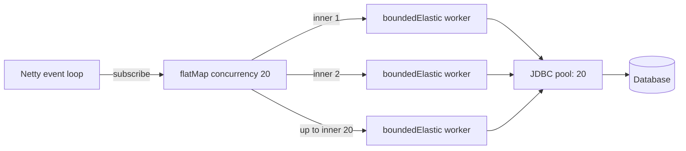

# Bounding blocking JDBC concurrency in a reactive pipeline

## Correct answer

d. Use inner `subscribeOn(boundedElastic())`; set `flatMap` concurrency to 20.

## Detailed explanation

Two independent controls are required. Each `Mono.fromCallable` is lazy but synchronous, so `subscribeOn` must be applied to that inner publisher to run its JDBC source on a scheduler intended for blocking work. Applying it to every inner publisher also allows different queries to occupy different bounded-elastic workers.

The second `flatMap` argument is its concurrency limit. It bounds how many inner publishers are subscribed at once, so at most 20 calls can enter `findBlocking`. As an inner query completes, `flatMap` subscribes to another until all 200 IDs have been processed.

This aligns application concurrency with the stated connection-pool capacity. The pool remains the final safety boundary, but the reactive pipeline no longer creates 180 extra blocking tasks that merely wait for a connection. In a real service, other database traffic may require a limit below the full pool size.



## Code example

```java
Flux<Order> findAll(List<Long> ids) {
    return Flux.fromIterable(ids)
        .flatMap(
            id -> Mono.fromCallable(() -> repo.findBlocking(id))
                .subscribeOn(Schedulers.boundedElastic()),
            20
        );
}
```

The numeric limit should normally come from capacity configuration rather than being hard-coded. It also needs to account for other endpoints and background work sharing the same JDBC pool.

## Why the other options are incorrect

- a. The outer scheduler prevents event-loop blocking, but each unscheduled callable runs synchronously during inner subscription on that worker. The calls are effectively serialized rather than reaching 20-way concurrency.
- b. In `flatMap(mapper, 200, 20)`, 200 is the concurrency limit. The final 20 is prefetch per inner publisher; it does not limit the number of JDBC calls to 20.
- c. `publishOn` affects signals after the source. The callable executes before that boundary, so the first blocking source can still run on the event-loop thread.
