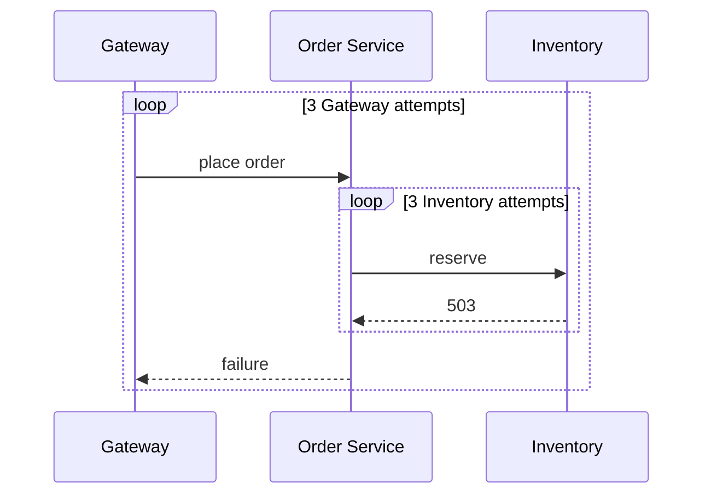

# How layered retries amplify downstream load

## Correct answer

c. Inventory receives 9 calls; one retry owner or a shared budget must cap amplification.

## Detailed explanation

Each configured maximum is a total attempt count, including the initial call. Order Service exhausts three Inventory attempts before returning failure to Gateway. Gateway then repeats the whole Order Service call up to three times. Because every Inventory call fails with a retryable 503, both loops exhaust:

`3 gateway attempts * 3 inventory attempts = 9 inventory calls`.

This multiplication is especially dangerous during an outage. More callers and more retrying layers turn a small failure into a retry storm, increasing downstream load precisely when the dependency is least able to serve it. Backoff and jitter spread calls over time, but they do not reduce the worst-case attempt count.

Give one layer retry ownership when possible. If several layers must participate, propagate an explicit end-to-end deadline and shared retry budget so inner attempts consume the same bounded allowance. Circuit breakers, concurrency limits, and load shedding provide additional protection, but they do not replace clear retry ownership.

Retries of state-changing operations also require idempotency. A timeout or connection loss does not prove that the previous attempt had no effect, so repeated Order Service calls must use an idempotency key or another safe replay contract.



## Code example

```java
final class CheckoutFlow {
    private final Inventory inventory;

    void placeWithGatewayOwnedRetry() {
        retry(3, this::placeOnce);
    }

    private void placeOnce() {
        inventory.reserve(); // Order Service does not start another retry loop.
    }

    private static void retry(int maxAttempts, Runnable operation) {
        for (int attempt = 1; ; attempt++) {
            try {
                operation.run();
                return;
            } catch (ServiceUnavailableException failure) {
                if (attempt == maxAttempts) {
                    throw failure;
                }
            }
        }
    }
}
```

With Gateway as the sole retry owner, three top-level attempts produce at most three Inventory calls. A production implementation should also propagate a deadline, apply backoff and jitter, and reuse the same idempotency key across attempts.

## Why the other options are incorrect

- a. Retry libraries at separate layers do not implicitly coordinate; each Gateway attempt starts a fresh Order Service retry loop.
- b. An attempt limit includes the initial call. Each layer performs three total attempts, so the multiplication is three by three.
- d. There are only two retrying layers in the stated call path. No third three-attempt loop exists to produce 27 calls.
