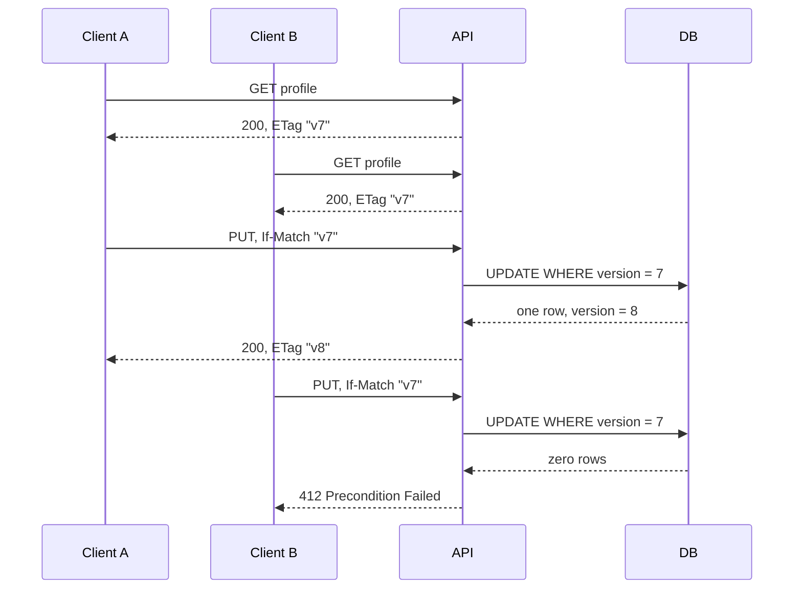

# Preventing lost updates with If-Match

## Correct answer

c. Require `If-Match: "v7"`; return `412 Precondition Failed` after A advances the tag.

## Detailed explanation

`If-Match` turns the update into a conditional request. For this contract, the server compares the supplied tag with the current representation using strong ETag comparison and performs the write only if they match.

Both clients initially hold `"v7"`. A's conditional update succeeds and creates `"v8"`. B still presents `"v7"`, so its precondition is false. The server returns `412 Precondition Failed` and must not apply B's payload. B can then GET the current representation, reconcile its change, and retry with the new tag.

The ETag check and database update must form one atomic compare-and-write operation. Reading the version, checking it in Java, and issuing an unconditional update later would leave a race between the check and the write. A version predicate in the `UPDATE` statement closes that race.



## Code example

The HTTP layer can decode the opaque ETag and pass its version to a repository that performs an atomic conditional update:

```java
int rows = jdbc.update("""
    UPDATE profile
       SET display_name = ?, version = version + 1
     WHERE id = ? AND version = ?
    """, command.displayName(), profileId, expectedVersion);

if (rows == 0) {
    return HttpResponse.status(412); // stale tag or resource no longer exists
}

return HttpResponse.ok()
    .header("ETag", "\"v" + (expectedVersion + 1) + "\"");
```

In production, the ETag should be generated and parsed consistently, and a client-supplied value must never be interpolated into SQL. The important guarantee is that the version comparison and mutation happen in the same database statement.

## Why the other options are incorrect

- a. `If-None-Match` permits the method only when the tag does not match, the opposite condition. A failed precondition on PUT is 412; 304 applies to conditional GET or HEAD.
- b. An idempotency key deduplicates retries of one logical operation. It does not detect that two different edits were derived from the same stale representation.
- d. Serial execution establishes an order but does not detect stale intent. B can run after A and still overwrite A unless its write carries a version precondition.
