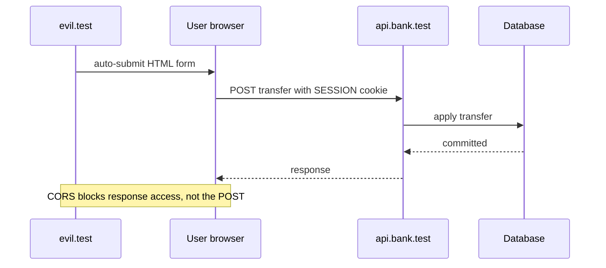

# Why restrictive CORS does not prevent cookie-based CSRF

## Correct answer

b. The POST can succeed with the cookie; CORS only prevents reading the response.

## Detailed explanation

CORS controls whether browser script from one origin may read a cross-origin response. It is not an authorization check for every request that a browser can send. HTML forms have always been able to submit certain cross-origin requests, so a form-urlencoded POST is sent without a CORS preflight.

Under the stated assumptions, the session cookie is eligible for the request. `SameSite=None` permits it on cross-site requests, `Secure` requires HTTPS, and `HttpOnly` only prevents JavaScript from reading the cookie value. `HttpOnly` does not stop the browser from attaching the cookie.

The API therefore authenticates the forged request as the logged-in user and can perform the transfer. Because `evil.test` is not in the allowlist, attacker-controlled JavaScript cannot read the response, but the state change has already happened.

The durable defense is to validate an unpredictable CSRF token or another explicit request-bound proof on unsafe requests. SameSite restrictions and Origin validation can add useful defense in depth, but the question explicitly removes them.



## Code example

Keep CSRF protection enabled so unsafe requests require a token that an attacker site cannot supply:

```java
@Bean
SecurityFilterChain securityFilterChain(HttpSecurity http) throws Exception {
    return http
        .cors(Customizer.withDefaults())
        .csrf(Customizer.withDefaults())
        .authorizeHttpRequests(auth -> auth
            .anyRequest().authenticated())
        .build();
}
```

For an HTML form, the legitimate application includes the generated token as a hidden parameter. A JavaScript client can send it in the CSRF header expected by the configured token repository. CORS may still restrict which origins can read API responses, but it serves a different security purpose.

## Why the other options are incorrect

- a. A CORS allowlist governs access to the response. It does not stop a cross-origin HTML form from sending this form-urlencoded POST.
- c. Form-urlencoded POSTs are CORS-safelisted requests when they use only safelisted headers, so this form does not trigger a preflight.
- d. `HttpOnly` blocks access through APIs such as `document.cookie`. The browser still attaches an eligible cookie to HTTP requests.
