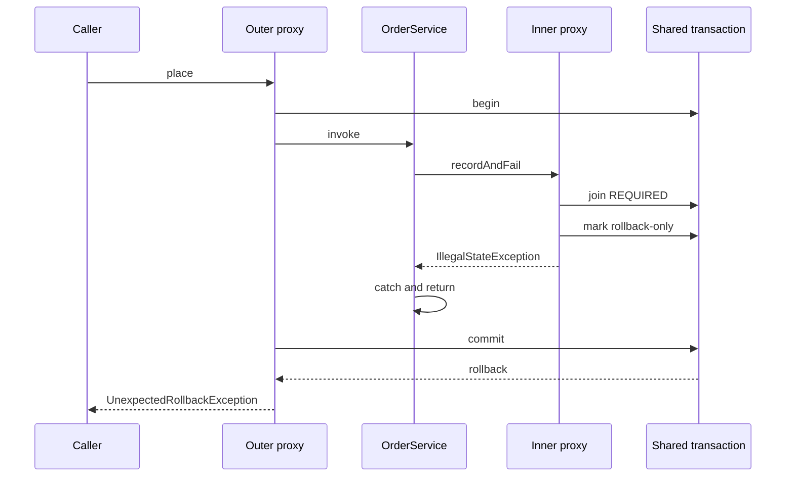

# Caught inner transaction failures and rollback-only

## Correct answer

c. It throws `UnexpectedRollbackException`; both inserts roll back.

## Detailed explanation

The two annotated methods do not create two physical transactions. The outer proxy starts one transaction, and the inner method's default `REQUIRED` propagation joins that transaction.

When `recordAndFail` throws an unchecked exception through its proxy, the inner transaction interceptor applies the default rollback rule and marks the shared transaction rollback-only. The outer method can catch the Java exception, but it cannot undo that transaction status.

After the outer method body reaches its end, its proxy attempts to commit. Spring detects that the participating inner scope requested rollback, rolls back the physical transaction, and throws `UnexpectedRollbackException` so the caller is not misled into believing that a commit occurred. Both inserts therefore roll back.



The correct repair depends on the required atomicity. If audit failure must fail the order, let the exception propagate. If the audit is explicitly best-effort and may fail independently, give it a separate transaction and handle that failure deliberately. This needs an additional connection while the outer transaction is suspended, so the connection pool must be sized for that concurrency.

## Code example

```java
@Service
class OrderService {
    @Transactional
    public void placeWithBestEffortAudit(long id) {
        jdbc.update("insert into customer_orders(id) values (?)", id);
        try {
            audit.recordInNewTransactionAndFail(id);
        } catch (IllegalStateException ignored) {
            // Record a metric or schedule a durable retry as required.
        }
    }
}

@Service
class AuditService {
    @Transactional(propagation = Propagation.REQUIRES_NEW)
    public void recordInNewTransactionAndFail(long id) {
        jdbc.update("insert into audit_events(order_id) values (?)", id);
        throw new IllegalStateException("audit failed");
    }
}
```

The inner transaction rolls back its audit insert and rethrows. The outer method catches that exception, and its independent transaction can commit the order insert.

## Why the other options are incorrect

- a. Catching the exception changes Java control flow, but it does not clear the rollback-only status set by the inner transaction interceptor.
- b. Both methods participate in one physical transaction under `REQUIRED`, so Spring cannot commit only the outer insert from that transaction.
- d. The outer method catches the original `IllegalStateException`; the later failure comes from the outer proxy when it discovers rollback-only at commit.
