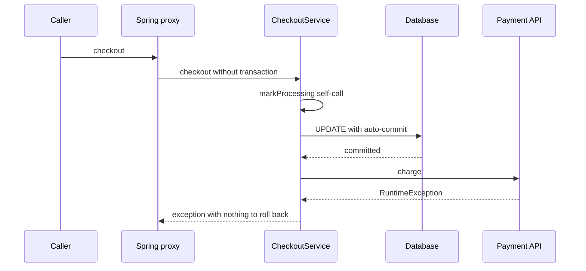

# Spring self-invocation bypasses transaction advice

## Correct answer

a. `markProcessing` has no Spring transaction; JDBC auto-commits, so the update remains.

## Detailed explanation

With proxy-based transaction management, `@Transactional` is applied by an interceptor when a method call enters the Spring proxy. The external call to `checkout` crosses the proxy, but `checkout` itself has no transaction annotation, so no transaction starts there.

Inside the target object, `markProcessing(orderId)` is an ordinary Java call on the same instance—equivalent to `this.markProcessing(orderId)`. It does not return to the proxy, so the transaction interceptor never sees the `REQUIRES_NEW` annotation. The annotation has no effect for this invocation.

Because the assumptions state that no transaction already exists and the connection pool uses `autoCommit=true`, `JdbcTemplate` executes the `UPDATE` on an auto-commit connection. The database commits the statement when it completes. The later `RuntimeException` from `charge` propagates through `checkout`, but there is no Spring transaction to mark rollback-only, so the `PROCESSING` update remains committed.

`REQUIRES_NEW` is not an intrinsic property of the Java method. It describes what the transaction interceptor must do when an invocation reaches that interceptor.



A clear fix is to move the independently transactional operation to another Spring bean. The cross-bean call then enters that bean's proxy and activates `REQUIRES_NEW`.

## Code example

```java
@Service
class ProcessingTransaction {
    private final JdbcTemplate jdbc;

    ProcessingTransaction(JdbcTemplate jdbc) {
        this.jdbc = jdbc;
    }

    @Transactional(propagation = Propagation.REQUIRES_NEW)
    public void markProcessing(long orderId) {
        jdbc.update(
            "update orders set status = 'PROCESSING' where id = ?",
            orderId
        );
    }
}

@Service
class CheckoutService {
    private final ProcessingTransaction processing;
    private final PaymentClient paymentClient;

    CheckoutService(
        ProcessingTransaction processing,
        PaymentClient paymentClient
    ) {
        this.processing = processing;
        this.paymentClient = paymentClient;
    }

    public void checkout(long orderId) {
        processing.markProcessing(orderId); // crosses the other bean's proxy
        paymentClient.charge(orderId);
    }
}
```

This version deliberately commits the status in its own transaction before the remote call. If that is not the intended business behavior, choose a different boundary—for example, an externally invoked transactional method for database work plus an outbox or state machine for the remote side effect. A database transaction cannot atomically roll back a completed external charge.

## Why the other options are incorrect

- b. The self-call does not reach the transaction interceptor, so `REQUIRES_NEW` never starts. A genuinely committed inner transaction also could not be rolled back by a later exception outside it.
- c. Spring does not make every method transactional merely because another method in the class has `@Transactional`. The unannotated `checkout` call starts no transaction.
- d. The self-call is valid Java and Spring does not reject it. It executes normally, but proxy advice—including transaction creation—is bypassed.
