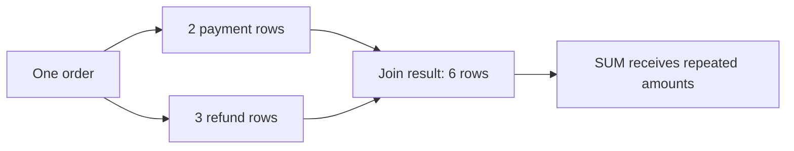

# Avoiding double counting across multiple one-to-many joins

## Correct answer

b. Aggregate each child by order_id first, then join the two one-row-per-order results.

## Detailed explanation

SQL aggregates operate on the rows produced by the FROM and JOIN clauses. They do not remember which source row was duplicated while constructing that intermediate result.

For one order with two payments and three refunds, joining both child tables produces six rows: every payment is paired with every refund. Each payment amount appears three times, and each refund amount appears twice. GROUP BY o.id collapses those six rows to one result row, but SUM has already received repeated values.



The safe design is to control the grain of every input. Aggregate payments to one row per order and refunds to one row per order. Joining those derived tables to orders then preserves at most one row from each side for every order.

This issue often appears when a report grows over time. A query that was correct with one child collection becomes wrong when another independent one-to-many join is added. The same pattern applies to invoices with lines and adjustments, customers with orders and support cases, or campaigns with clicks and conversions.

## Code example

```sql
WITH payment_totals AS (
    SELECT order_id, SUM(amount) AS paid
    FROM payments
    GROUP BY order_id
),
refund_totals AS (
    SELECT order_id, SUM(amount) AS refunded
    FROM refunds
    GROUP BY order_id
)
SELECT o.id,
       COALESCE(p.paid, 0) AS paid,
       COALESCE(r.refunded, 0) AS refunded
FROM orders o
LEFT JOIN payment_totals p ON p.order_id = o.id
LEFT JOIN refund_totals r ON r.order_id = o.id;
```

The CTEs are used here for clarity; equivalent grouped subqueries are also correct. COALESCE converts the NULL from a missing child aggregate to zero when that matches the report's business meaning.

## Why the other options are incorrect

- a. SUM(DISTINCT amount) removes equal numeric values, not duplicated source rows. Two legitimate payments of the same amount would be counted only once.
- c. INNER JOIN changes which orders survive, but it still creates every payment/refund combination when both children contain multiple rows.
- d. Grouping by child IDs changes the result grain to payment/refund pairs. It produces multiple rows per order rather than correct order-level totals.
