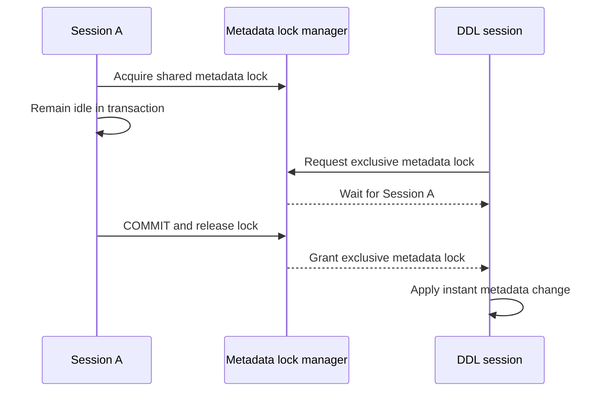

# MySQL instant DDL blocked by an idle transaction

## Correct answer

a. Instant DDL avoids a row rewrite, but ALTER still needs an exclusive metadata lock.

## Detailed explanation

MySQL takes metadata locks (MDL) to keep a table definition stable while a statement uses it. When a table is accessed inside an explicit transaction, the transaction can retain its metadata lock until `COMMIT` or `ROLLBACK`, even after the `SELECT` itself has finished.

An `ALTER TABLE` requires an exclusive metadata lock before changing the table definition. `ALGORITHM=INSTANT` greatly reduces the work after that lock is granted: for supported changes, MySQL updates dictionary metadata without copying all table rows. It does not remove the exclusive-lock requirement.

Therefore Session B can remain in a metadata-lock wait behind an old, apparently harmless read transaction. The operational fix is to end the blocking transaction. The preventive fix is to keep transactions short, avoid idle-in-transaction connections, set suitable transaction timeouts, and inspect blockers before running production DDL.



A queued exclusive metadata-lock request can also affect later traffic: depending on lock scheduling, new statements that need conflicting locks may queue behind the waiting DDL. A migration that merely appears stuck can therefore become a broader availability incident.

## Code example

```sql
-- Find waiting and blocking metadata locks.
SELECT
    waiting_pid,
    waiting_query,
    blocking_pid,
    blocking_query
FROM sys.schema_table_lock_waits
WHERE object_schema = DATABASE()
  AND object_name = 'customers';

-- Inspect transaction age before deciding how to intervene.
SELECT
    trx_mysql_thread_id,
    trx_started,
    trx_state,
    trx_query
FROM information_schema.innodb_trx
ORDER BY trx_started;

-- End the blocking transaction in its owning session.
ROLLBACK;

-- Retry during a controlled window and fail instead of waiting indefinitely.
SET SESSION lock_wait_timeout = 15;

ALTER TABLE customers
    ADD COLUMN marketing_opt_in boolean NOT NULL DEFAULT false,
    ALGORITHM=INSTANT;
```

Before terminating a production session, verify what the transaction owns and whether rollback has business impact. A low `lock_wait_timeout` limits how long the DDL waits for a metadata lock; it does not make the ALTER lock-free.

## Why the other options are incorrect

- b. A supported instant operation does not rewrite every existing row. The delay occurs before the metadata change, while the ALTER waits to acquire its metadata lock.
- c. A normal consistent `SELECT` does not lock every matching InnoDB row. The relevant blocker here is the transaction-scoped metadata lock on the table definition.
- d. MySQL releases the metadata lock when the transaction ends; restarting the connection is unnecessary. A normal `COMMIT` or `ROLLBACK` is sufficient.
