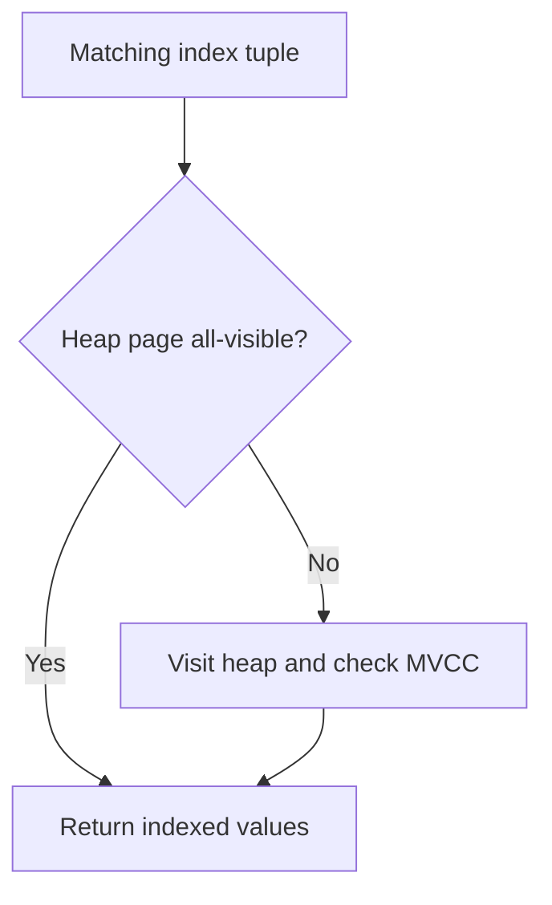

# Why an index-only scan can still fetch the heap

## Correct answer

c. Updated pages lose all-visible bits, forcing heap checks; tune vacuum or reduce churn.

## Detailed explanation

An `Index Only Scan` plan means that the index contains every value needed by the query. It does not promise that PostgreSQL will never visit the heap.

PostgreSQL still has to decide whether each tuple is visible to the query's MVCC snapshot. That visibility information belongs to the heap tuple, not to the index entry. To avoid checking every tuple, PostgreSQL maintains a visibility map with an all-visible bit for each heap page.

- If the bit is set, the executor can return the values directly from the index.
- If the bit is not set, the executor visits the heap to check tuple visibility.

Updates create new tuple versions and clear the affected page's all-visible bit. On a frequently updated table, many matching pages may therefore require heap visits even though the plan node is named `Index Only Scan`. The `Heap Fetches: 96` counter shows that 96 of the 100 returned rows needed such a visit.



Vacuum can mark eligible pages all-visible again. A useful investigation is to compare the real execution statistics before and after vacuuming, then inspect whether update churn and autovacuum cadence explain the result:

## Code example

```sql
EXPLAIN (ANALYZE, BUFFERS)
SELECT created_at, total_amount, status
FROM orders
WHERE customer_id = 42
ORDER BY created_at DESC
LIMIT 100;

VACUUM (ANALYZE) orders;

EXPLAIN (ANALYZE, BUFFERS)
SELECT created_at, total_amount, status
FROM orders
WHERE customer_id = 42
ORDER BY created_at DESC
LIMIT 100;

SELECT n_tup_upd, n_dead_tup, last_autovacuum
FROM pg_stat_user_tables
WHERE relname = 'orders';
```

If vacuum temporarily reduces heap fetches but they quickly return, consider per-table autovacuum tuning, avoiding unnecessary updates, separating hot mutable data from colder data, or accepting that this workload may not benefit much from a covering index. Also account for the extra storage and write cost of the wider index. `VACUUM FULL` or rebuilding the index is not the normal fix for missing all-visible bits.

## Why the other options are incorrect

- a. Values listed in `INCLUDE` are physically stored in index leaf tuples and can satisfy the projection. Moving them into the key changes indexing semantics and does not provide MVCC visibility information.
- b. This is runtime visibility behavior, not a stale-plan problem. Replanning may choose a different access path, but it cannot make recently changed heap pages all-visible.
- d. The B-tree already provides the requested ordering and `LIMIT` lets execution stop early. Heap visits are for visibility checks, not for confirming index order.
