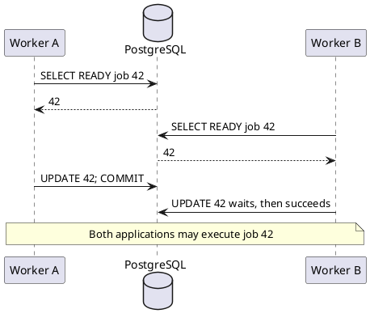

# Safely claiming PostgreSQL queue jobs

## Correct answer

b. Both SELECT statements may see READY before either worker commits its UPDATE.

## Detailed explanation

At PostgreSQL's default READ COMMITTED isolation level, each statement sees a snapshot containing rows committed before that statement began. The plain `SELECT` takes no row lock that excludes another worker's plain `SELECT`. Two workers can therefore read the same `READY` row before either changes it.

The first `UPDATE` obtains the row lock. The second `UPDATE` waits, but waiting does not invalidate the ID it selected earlier. After the first transaction commits, the second update can proceed because its predicate is only `WHERE id = :selected_id`; it overwrites the claim. If both applications execute the job selected before the update, the job runs twice.



Claiming and execution are separate concerns. `FOR UPDATE SKIP LOCKED` lets concurrent workers claim different rows while the claim transaction is open. After committing the claim, perform the slow external work outside the transaction. Production queues also need idempotent handlers and usually a lease or recovery process for workers that crash after claiming.

## Code example

```sql
BEGIN;

WITH candidate AS (
    SELECT id
    FROM jobs
    WHERE status = 'READY'
    ORDER BY created_at, id
    FOR UPDATE SKIP LOCKED
    LIMIT 1
)
UPDATE jobs AS j
SET status = 'PROCESSING',
    worker_id = :worker_id,
    claimed_at = clock_timestamp()
FROM candidate
WHERE j.id = candidate.id
RETURNING j.*;

COMMIT;
```

The row lock is acquired while choosing the candidate, and `SKIP LOCKED` makes another worker skip already claimed candidates instead of waiting. The `UPDATE ... RETURNING` statement gives the application a job only when it actually claimed one.

## Why the other options are incorrect

- a. A unique tie-breaker makes selection deterministic, but it does not stop two workers from selecting the same row.
- c. PostgreSQL holds an UPDATE row lock until commit or rollback; the race begins before either UPDATE obtains it.
- d. PostgreSQL does not commit SELECT results separately, and rollback is not what permits both workers to execute the job.
