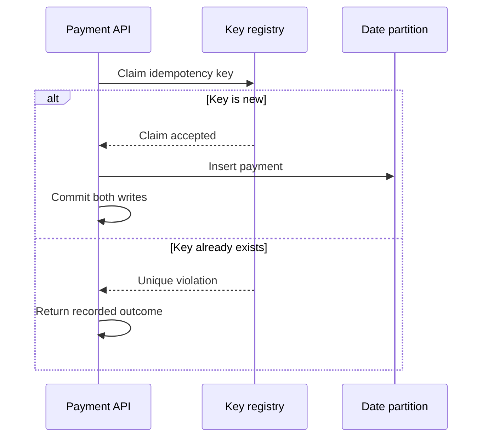

# Global idempotency across PostgreSQL date partitions

## Correct answer

d. Claim the key in an unpartitioned registry, then insert the payment in the same transaction.

## Detailed explanation

PostgreSQL cannot create this unique constraint on the partitioned table. A unique or primary-key constraint on a partitioned table must include every partitioning column. Otherwise, two rows with the same `idempotency_key` could be routed to different child partitions, whose local indexes cannot detect each other.

Adding `created_at` makes the constraint legal, but changes its meaning. The pair `(idempotency_key, created_at)` is unique, so the same idempotency key may still appear once on Monday and again on Tuesday.

Keep the large payment history partitioned by date, but claim each idempotency key in a small unpartitioned registry. Its primary key is a single global arbitration point. Insert the registry row and payment row in one database transaction. If payment insertion or commit fails, the registry claim rolls back with it.



The registry can also store the stable `payment_id` and final response state. A retry that loses the primary-key race reads that row and returns the original result instead of creating another payment.

## Code example

```sql
CREATE TABLE payment_requests (
    idempotency_key text PRIMARY KEY,
    payment_id uuid NOT NULL UNIQUE,
    created_at timestamptz NOT NULL DEFAULT clock_timestamp()
);

CREATE TABLE payments (
    payment_id uuid NOT NULL,
    created_at date NOT NULL,
    amount numeric(12, 2) NOT NULL,
    PRIMARY KEY (payment_id, created_at)
) PARTITION BY RANGE (created_at);

BEGIN;

INSERT INTO payment_requests (idempotency_key, payment_id)
VALUES (:idempotency_key, :payment_id)
ON CONFLICT (idempotency_key) DO NOTHING
RETURNING payment_id;

-- Continue only when the claim returned a row.
INSERT INTO payments (payment_id, created_at, amount)
VALUES (:payment_id, CURRENT_DATE, :amount);

COMMIT;

-- If the claim returned no row, load the existing payment instead.
SELECT payment_id
FROM payment_requests
WHERE idempotency_key = :idempotency_key;
```

Production code must branch on whether the claim returned a row. It must not execute the payment insert after `ON CONFLICT DO NOTHING` reports an existing key. Keeping both writes in one transaction prevents an abandoned registry entry when the payment insert fails.

## Why the other options are incorrect

- a. Including `created_at` satisfies PostgreSQL's DDL rule, but uniqueness then applies to the pair. The same key can be accepted again on another date.
- b. Per-partition unique indexes enforce uniqueness only inside each child table. PostgreSQL does not probe every other partition to provide a global constraint.
- c. Advisory locks coordinate concurrent attempts only while sessions hold them. They do not durably remember keys after commit and cannot replace a uniqueness constraint.
