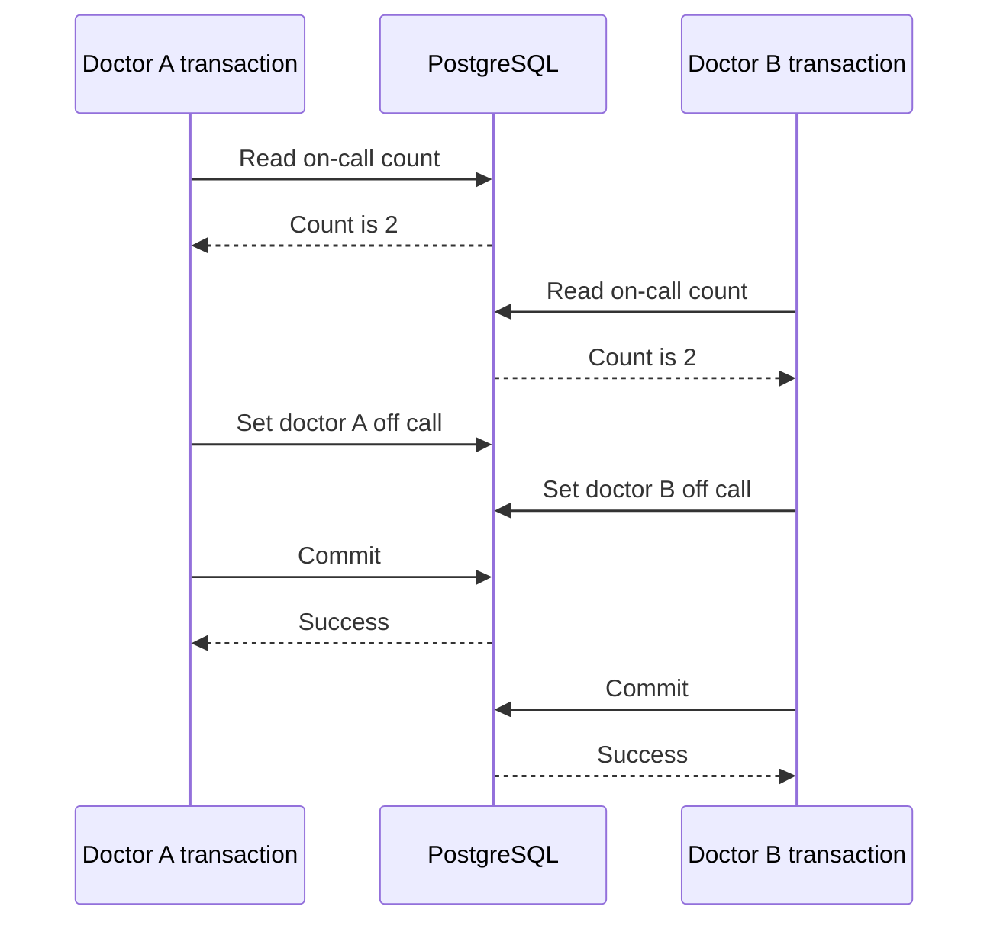

# PostgreSQL REPEATABLE READ and write skew

## Correct answer

c. Both snapshots see two doctors, while the transactions update different rows and do not conflict.

## Detailed explanation

PostgreSQL `REPEATABLE READ` uses snapshot isolation. Each transaction reads from a stable snapshot, so both doctors can observe that two rows are currently on call. Each then decides it is safe to set only its own row to `on_call = false`.

The writes target different rows. There is no write-write conflict for PostgreSQL to reject, and neither transaction sees the other's later change in its snapshot. Both can commit, leaving zero doctors on call. Each transaction was valid relative to its own snapshot, but the combined result violates the cross-row invariant. This anomaly is called write skew.



Use `SERIALIZABLE` when PostgreSQL must detect this read-write dependency. Serializable Snapshot Isolation can abort one transaction with a serialization failure, so the application must retry the entire transaction from the beginning.

Another valid design is to serialize decisions through a shared row representing the shift. Lock that row with `SELECT ... FOR UPDATE` before reading and changing doctor assignments. Both approaches give competing transactions a common point of conflict. A schema redesign that represents the invariant with a directly enforceable constraint can be even stronger, but a simple constraint across an arbitrary set of rows is not generally available as a normal PostgreSQL `CHECK` constraint.

## Code example

```sql
BEGIN ISOLATION LEVEL SERIALIZABLE;

SELECT count(*)
FROM doctors
WHERE shift_id = :shift_id
  AND on_call = true;

-- Proceed only when another doctor remains on call.
UPDATE doctors
SET on_call = false
WHERE id = :my_doctor_id;

COMMIT;
```

The application must treat SQLSTATE `40001` as a retryable serialization failure and rerun the complete transaction, including the count. Retrying only the final `UPDATE` would reuse a decision made from an invalidated snapshot.

A shared-row locking alternative is:

```sql
BEGIN;

SELECT id
FROM shifts
WHERE id = :shift_id
FOR UPDATE;

SELECT count(*)
FROM doctors
WHERE shift_id = :shift_id
  AND on_call = true;

UPDATE doctors
SET on_call = false
WHERE id = :my_doctor_id;

COMMIT;
```

Every code path that changes the on-call assignment must acquire the same shift lock, otherwise the invariant remains vulnerable.

## Why the other options are incorrect

- a. The transactions update different doctor rows, not the same row. The anomaly comes from both decisions using snapshots that show the old aggregate state.
- b. Per-row optimistic versions would detect concurrent changes to the same doctor, but these transactions modify different rows. They would not protect the cross-row invariant.
- d. PostgreSQL REPEATABLE READ does not acquire the predicate locks used by Serializable Snapshot Isolation to detect dangerous dependency structures. The transactions also do not overwrite each other's rows.
