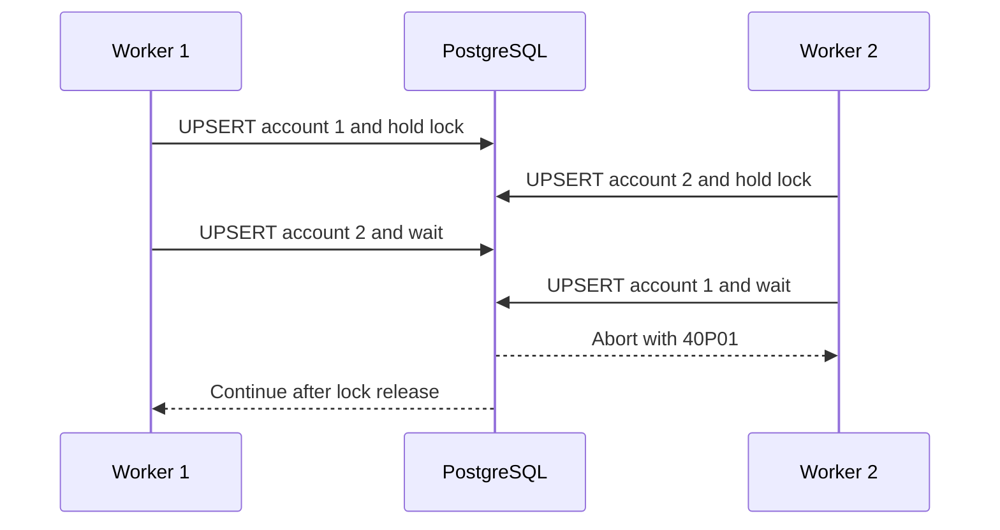

# Preventing PostgreSQL UPSERT deadlocks with lock ordering

## Correct answer

d. Sort account keys before every UPSERT and retry the whole transaction on SQLSTATE 40P01.

## Detailed explanation

INSERT ... ON CONFLICT DO UPDATE must coordinate through the unique index and lock a conflicting row before updating it. The statement is atomic for one proposed row, but a transaction that processes several keys can still deadlock with another transaction.

Worker 1 updates account 1 and keeps that lock until commit. Worker 2 updates account 2 and keeps its lock. Worker 1 then waits for account 2 while Worker 2 waits for account 1. PostgreSQL detects the cycle and aborts one transaction with SQLSTATE 40P01; it cannot safely allow both to continue.



All code paths that touch the same set of objects should acquire them in one deterministic order, such as ascending account_id. This removes this particular wait cycle. The application must still treat deadlocks as retryable because other tables, triggers, foreign keys, or code paths can introduce additional lock orders.

A deadlock aborts the transaction, not merely its last statement. Therefore the retry boundary must include the entire transaction, with rollback and backoff before another attempt. Any external side effect must be kept outside the retried transaction or made idempotent.

## Code example

```sql
-- The application first sorts the batch as [1, 2].
-- Every worker uses this same order.
BEGIN;

INSERT INTO account_totals (account_id, total) VALUES (1, 10)
ON CONFLICT (account_id) DO UPDATE
SET total = account_totals.total + EXCLUDED.total;

INSERT INTO account_totals (account_id, total) VALUES (2, 20)
ON CONFLICT (account_id) DO UPDATE
SET total = account_totals.total + EXCLUDED.total;

COMMIT;

-- If any statement reports SQLSTATE 40P01:
-- ROLLBACK, apply bounded backoff, then execute the whole transaction again.
```

The ordering rule must be shared by every producer of these updates. Sorting only one worker or only one endpoint leaves another possible inverted order. Retries should be bounded, observable, and safe to repeat.

## Why the other options are incorrect

- a. deadlock_timeout controls how soon PostgreSQL checks for a deadlock. Waiting longer cannot break a cycle in which each transaction needs the other to release a lock.
- b. PostgreSQL treats READ UNCOMMITTED as READ COMMITTED, and isolation level does not remove the locking required to enforce a unique constraint and update a conflicting row.
- c. A separate SELECT and INSERT creates a check-then-act race. Another transaction can insert or modify the key after the read, so unique enforcement and conflict handling are still required.
