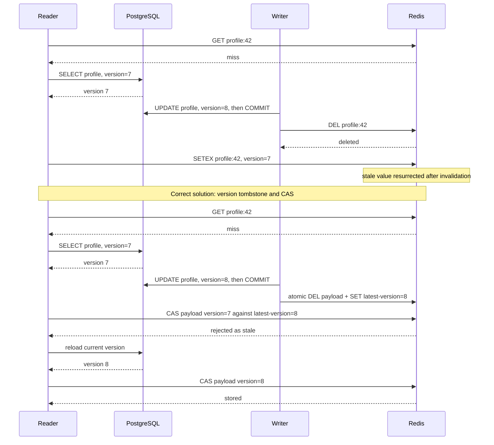

# Preventing stale cache resurrection after invalidation

## Correct answer

c. Keep a version tombstone and reject cache writes older than the recorded version.

## Detailed explanation

Cache-aside invalidation after the database commit avoids one common failure: readers do not observe an invalidation before an update that later rolls back. It does not, however, make a cache miss and refill atomic with a concurrent write.

The reader can miss Redis and read profile version 7 from the database. Before it refills Redis, the writer commits version 8 and successfully deletes the key. The delayed reader then writes version 7 into the now-empty cache. Every following request can receive the old profile until the TTL expires, even though the invalidation itself succeeded.



A robust versioned design keeps the newest known version independently of the cached payload. The writer advances that version, or installs a short-lived tombstone containing version 8, after the database commit. A refill uses an atomic compare-and-set operation: it may store version 7 only if the recorded version is not newer. Redis Lua, a transaction, or a purpose-built conditional command can make the comparison and write one atomic operation.

The tombstone must live long enough to cover the maximum realistic in-flight read and retry delay. Versioning also requires a monotonic source, such as a database row version or commit sequence. This adds state and operational complexity, so many systems instead accept bounded staleness, use short TTLs, update the cache synchronously, or route reads and writes for one key through the same owner. The right choice follows the business cost of stale reads.

## Code example

The application code is Java. The writer records the committed database version while invalidating
the payload, and the reader asks Redis to cache a database result only if its version is still current.

```java
final class ProfileService {
    private final ProfileRepository repository;
    private final VersionedProfileCache cache;

    Profile get(long profileId) {
        return cache.get(profileId).orElseGet(() -> loadCurrent(profileId));
    }

    private Profile loadCurrent(long profileId) {
        for (int attempt = 0; attempt < 2; attempt++) {
            VersionedProfile loaded = repository.findVersioned(profileId);

            // Runs the Lua compare-and-set script shown below.
            if (cache.storeIfCurrent(profileId, loaded, Duration.ofMinutes(5))) {
                return loaded.profile();
            }

            // A newer version tombstone rejected this result; reload from the database.
        }

        return repository.findVersioned(profileId).profile();
    }

    void update(long profileId, ProfileChange change) {
        VersionedProfile committed =
            repository.updateAndIncrementVersion(profileId, change);

        // Atomically deletes the payload and records committed.version() as the tombstone.
        cache.invalidateAndRecordVersion(profileId, committed.version());
    }
}
```

The following snippet is **Lua code executed atomically by Redis**. It implements
`storeIfCurrent(...)` from the Java example.

```lua
-- Redis provides the payload key and its separate version/tombstone key in KEYS.
-- The delayed reader provides the DB version, cache TTL, and serialized payload in ARGV.
local payload_key = KEYS[1]
local version_key = KEYS[2]
local candidate_version = tonumber(ARGV[1])
local ttl_seconds = tonumber(ARGV[2])
local payload = ARGV[3]

-- Read the newest version known to the cache. This key remains present even when
-- the payload has been deleted, so an old in-flight reader cannot resurrect it.
local latest = redis.call('GET', KEYS[2])

-- A greater version means a writer committed after this reader loaded its value.
-- Reject the stale write without changing either Redis key.
if latest and tonumber(latest) > candidate_version then
  return 0
end

-- The candidate is current. Store both payload and version in this same atomic
-- script, so another client cannot interleave a newer version between the writes.
redis.call('SET', payload_key, payload, 'EX', ttl_seconds)
redis.call('SET', version_key, candidate_version, 'EX', ttl_seconds)

-- Return 1 to tell Java that the payload was accepted and may be returned.
return 1
```

The writer records version 8 in the version key after committing. When the delayed reader attempts to install version 7, the script returns `0` without changing the payload. In production, the payload and version-key expiry policy must ensure that removing the guard cannot reopen the race for an older in-flight request.

## Why the other options are incorrect

- a. A longer TTL makes a resurrected stale value survive longer. Retrying deletion can reduce the window probabilistically, but a delayed reader can still refill after the final retry.
- b. A reader-only single-flight lock coalesces concurrent misses, but writers do not participate in its ordering. One locked reader can still refill stale data after the writer deletes the key.
- d. Deleting before commit creates additional races: readers can reload the old database value before commit, and a rolled-back transaction leaves the cache invalidated without publishing any new state.
