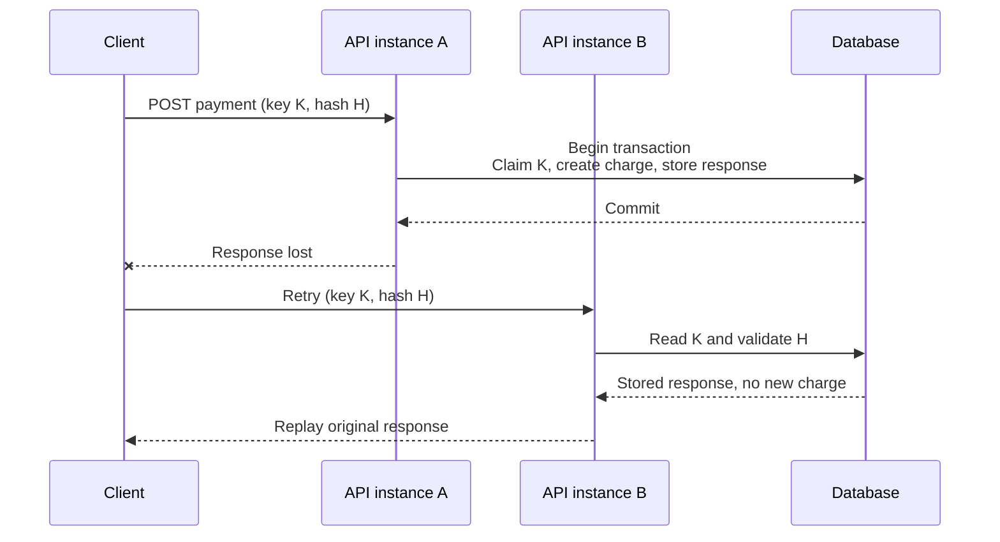

# Idempotent payment retries after a lost response

## Correct answer

d. Atomically store the key, request hash, charge, and response; replay it only for the same hash.

## Detailed explanation

An ambiguous timeout does not tell the client whether the operation failed or whether it committed and only the response was lost. Retrying is therefore necessary, but retrying the business operation without durable deduplication can charge twice.

The idempotency key must be scoped to the caller, such as `(merchant_id, idempotency_key)`, rather than being globally trusted. Within one database transaction, the server claims that key, validates that its stored request hash matches the retry, performs the charge, and stores the exact response to replay. The uniqueness constraint serializes concurrent attempts for the same key.

If the transaction commits, the charge and replay record both exist. If it rolls back, neither exists, so a later retry may execute safely. A retry after a committed-but-lost response reads the stored result instead of performing the charge again. Reusing the same key with a different request hash must produce a conflict rather than silently returning an unrelated result.



The stored response should contain the stable business result, such as payment ID, status, and response body. Operational details need care: retain records at least as long as clients may retry; define behavior for an in-progress attempt; and do not mark an operation successful before every atomic business write has committed.

## Code example

The following PostgreSQL transaction claims a key and locks an existing claim before deciding whether to execute or replay:

```sql
BEGIN;

INSERT INTO idempotency_keys (
    merchant_id, idempotency_key, request_hash, status
) VALUES (42, 'K', 'sha256:H', 'IN_PROGRESS')
ON CONFLICT (merchant_id, idempotency_key) DO NOTHING;

SELECT request_hash, status, response_json
FROM idempotency_keys
WHERE merchant_id = 42 AND idempotency_key = 'K'
FOR UPDATE;

-- Application logic now rejects a different request_hash.
-- For COMPLETED, it commits and replays response_json.
-- For the newly inserted IN_PROGRESS row, it creates the payment below.

INSERT INTO payments (merchant_id, amount_cents, currency)
VALUES (42, 2500, 'EUR')
RETURNING id;

UPDATE idempotency_keys
SET status = 'COMPLETED',
    response_json = '{"paymentId":731,"status":"accepted"}'::jsonb
WHERE merchant_id = 42 AND idempotency_key = 'K';

COMMIT;
```

In production, application logic must distinguish whether its `INSERT` created the row. A pre-existing `IN_PROGRESS` row may be locked by its owner until commit; after the lock is acquired, its final state becomes visible. The payment table should also carry an appropriate unique business reference as defense in depth.

## Why the other options are incorrect

- a. A cache can evict the key, expire early, or diverge from the database commit. Returning generic success also cannot reproduce the original payment ID or distinguish different payloads that reused the key.
- b. Similar fields are not an operation identity. Two intentional payments may have the same customer and amount, while concurrent queries can both observe no match and both create a charge.
- c. Splitting the claim and charge across transactions creates partial states. A crash after charging but before finalizing the key can leave a marker that never completes; deleting it may permit the same charge to run again.
