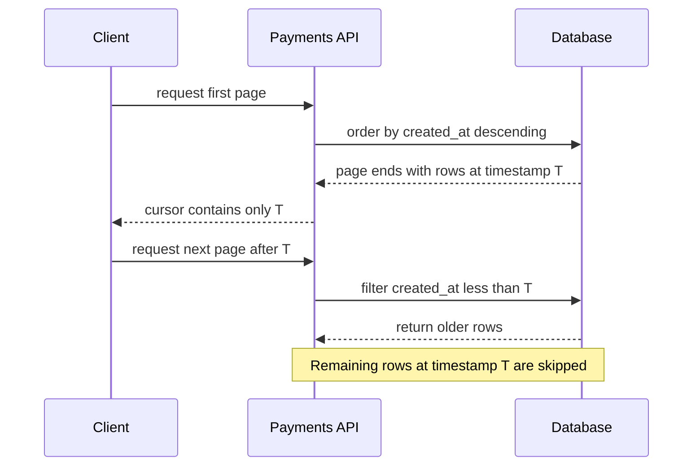

# Reliable keyset pagination when timestamps tie

## Correct answer

b. Order and cursor by (created_at, id), with a matching composite keyset predicate.

## Detailed explanation

Keyset pagination works only when the ordering columns identify an unambiguous position. Here, `created_at` is not unique. If page 1 ends in the middle of several rows that share timestamp T, the next predicate uses `created_at < T`. Every remaining row with `created_at = T` is excluded, so those rows are skipped permanently.

Adding `id` as a stable unique tie-breaker creates a total order. The cursor must carry both values, the `ORDER BY` must use both values in the same direction, and the next-page predicate must compare the same pair.



The composite cursor solves ambiguity at page boundaries, but it does not provide a database snapshot across separate HTTP requests. Concurrent deletions can still make rows disappear, and business requirements may need a snapshot watermark when the client must traverse an immutable result set.

## Code example

```sql
SELECT id, created_at, amount
FROM payments
WHERE tenant_id = :tenant_id
  AND (
      :cursor_created_at IS NULL
      OR (created_at, id) < (:cursor_created_at, :cursor_id)
  )
ORDER BY created_at DESC, id DESC
LIMIT 50;

CREATE INDEX payments_tenant_created_id_idx
    ON payments (tenant_id, created_at DESC, id DESC);
```

The final row of each page supplies both cursor values. PostgreSQL row-value comparison applies the same lexicographic ordering as the two descending sort keys. The composite index supports the tenant filter, ordered scan, and efficient seek from the cursor.

For databases or query builders without row-value comparison, use the expanded equivalent:

```sql
AND (
    created_at < :cursor_created_at
    OR (created_at = :cursor_created_at AND id < :cursor_id)
)
```

The cursor should be encoded as one opaque API token so clients cannot accidentally provide only half of the position. Signing the token may prevent tampering, but correctness still comes from the composite ordering fields.

## Why the other options are incorrect

- a. Row locks do not naturally span stateless HTTP requests and would create long contention without fixing the non-unique cursor.
- c. Higher precision reduces collisions but cannot guarantee uniqueness, especially for batch inserts or application timestamps.
- d. Mixing OFFSET with a moving data set reintroduces shifting-page duplicates and skips, and still lacks a stable tie-breaker.
