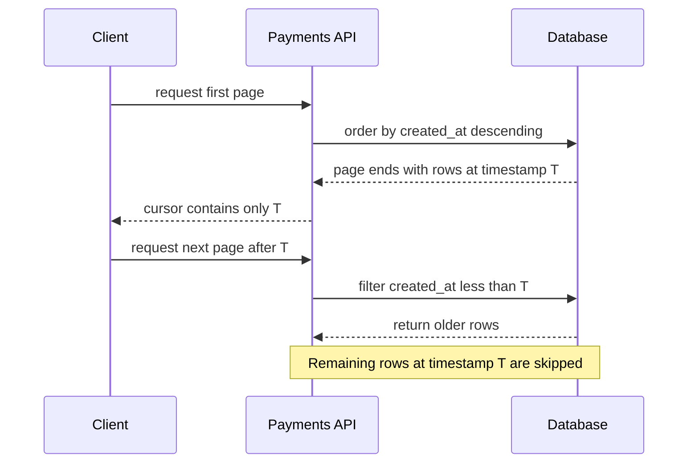

# Reliable keyset pagination when timestamps tie

## Correct answer

b. Order and cursor by (created_at, id), with a matching composite keyset predicate.

## Detailed explanation

Keyset pagination works only when the ordering columns identify an unambiguous position. Here, `created_at` is not unique.

A cursor here is an application/API pagination position, not a SQL cursor. It contains values taken from the last row returned on the previous page. With composite keyset pagination, that position is `(created_at, id)`.

Suppose page 1 ends like this:

```text
10:05  id=105
10:04  id=104
10:03  id=103  <- last row returned, so T = 10:03
```

The next request carries exactly `T = 10:03`, equal to the last row's `created_at`; it does not calculate a slightly smaller timestamp or add/subtract a duration. A naive predicate then uses `created_at < T`, so the rows returned next have timestamps smaller than `10:03`.

The problem is that another row may have the same timestamp but fall beyond page 1's limit:

```text
10:03  id=102  <- not returned on page 1
```

Because `10:03 < 10:03` is false, that row is skipped. Adding `id` as a stable unique tie-breaker creates a total order. The cursor carries `(10:03, 103)`, and the composite predicate can continue within timestamp `10:03` by returning `id=102` before moving to rows with smaller timestamps.

The cursor must carry both values, the `ORDER BY` must use both values in the same direction, and the next-page predicate must compare the same pair.



The composite cursor solves ambiguity at page boundaries, but it does not provide a database snapshot across separate HTTP requests. Concurrent deletions can still make rows disappear, and business requirements may need a snapshot watermark when the client must traverse an immutable result set.

## Code example

```sql
SELECT id, created_at, amount
FROM payments
WHERE tenant_id = :tenant_id
  AND (
      :cursor_created_at IS NULL
      OR (created_at, id) < (:cursor_created_at, :cursor_id)
  )
ORDER BY created_at DESC, id DESC
LIMIT 50;

CREATE INDEX payments_tenant_created_id_idx
    ON payments (tenant_id, created_at DESC, id DESC);
```

The final row of each page supplies both cursor values. PostgreSQL row-value comparison applies the same lexicographic ordering as the two descending sort keys. The composite index supports the tenant filter, ordered scan, and efficient seek from the cursor.

Here is a Java example using Spring JDBC. The repository executes a first-page query without a cursor or a next-page query using both values from the previous page's final row.

```java
public record Payment(long id, Instant createdAt, BigDecimal amount) {}

public record PaymentCursor(Instant createdAt, long id) {}

@Repository
public class PaymentRepository {

    private static final String BASE_QUERY = """
            SELECT id, created_at, amount
            FROM payments
            WHERE tenant_id = :tenantId
            """;

    private static final String ORDER_AND_LIMIT = """
            ORDER BY created_at DESC, id DESC
            LIMIT :limit
            """;

    private final NamedParameterJdbcTemplate jdbc;

    public PaymentRepository(NamedParameterJdbcTemplate jdbc) {
        this.jdbc = jdbc;
    }

    public List<Payment> findPage(
            long tenantId,
            PaymentCursor cursor,
            int limit
    ) {
        String seekCondition = cursor == null
                ? ""
                : """
                  AND (created_at, id) < (:cursorCreatedAt, :cursorId)
                  """;

        MapSqlParameterSource parameters = new MapSqlParameterSource()
                .addValue("tenantId", tenantId)
                .addValue("limit", limit);

        if (cursor != null) {
            parameters
                    .addValue("cursorCreatedAt", Timestamp.from(cursor.createdAt()))
                    .addValue("cursorId", cursor.id());
        }

        return jdbc.query(
                BASE_QUERY + seekCondition + ORDER_AND_LIMIT,
                parameters,
                (resultSet, rowNumber) -> new Payment(
                        resultSet.getLong("id"),
                        resultSet.getTimestamp("created_at").toInstant(),
                        resultSet.getBigDecimal("amount")
                )
        );
    }
}
```

A service can call it first with no cursor and then construct the next cursor from the last returned payment:

```java
List<Payment> firstPage = repository.findPage(tenantId, null, 50);

Payment last = firstPage.getLast();
PaymentCursor nextCursor = new PaymentCursor(last.createdAt(), last.id());

List<Payment> secondPage = repository.findPage(tenantId, nextCursor, 50);
```

In an HTTP API, encode `PaymentCursor` as one opaque token and return it alongside the page. The client sends that token back unchanged; the server decodes it before calling `findPage`.

For databases or query builders without row-value comparison, use the expanded equivalent:

```sql
AND (
    created_at < :cursor_created_at
    OR (created_at = :cursor_created_at AND id < :cursor_id)
)
```

The cursor should be encoded as one opaque API token so clients cannot accidentally provide only half of the position. Signing the token may prevent tampering, but correctness still comes from the composite ordering fields.

## Why the other options are incorrect

- a. Row locks do not naturally span stateless HTTP requests and would create long contention without fixing the non-unique cursor.
- c. Higher precision reduces collisions but cannot guarantee uniqueness, especially for batch inserts or application timestamps.
- d. Mixing OFFSET with a moving data set reintroduces shifting-page duplicates and skips, and still lacks a stable tie-breaker.
