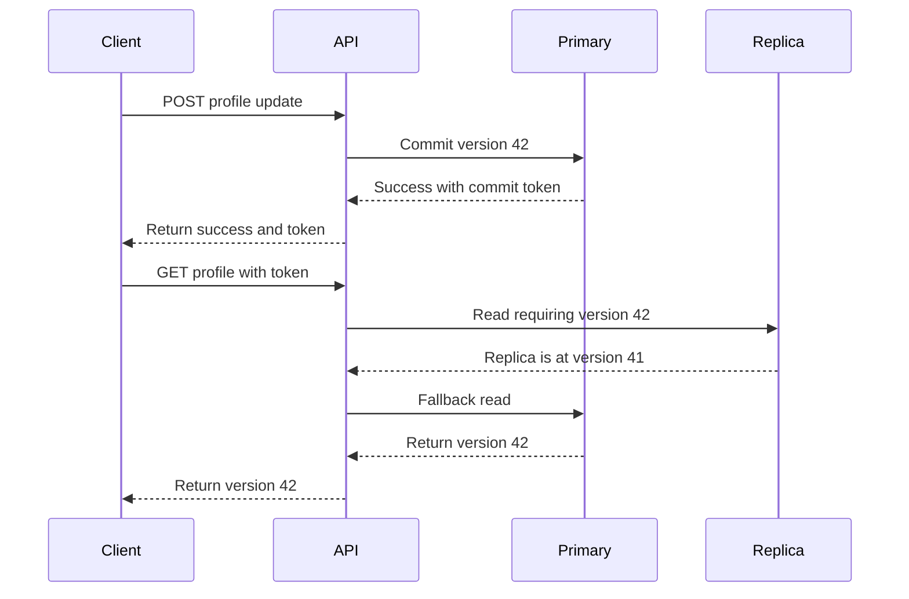

# Preserving read-your-writes with asynchronous replicas

## Correct answer

c. Return a commit token and use a replica only after it reaches that position, otherwise use primary.

## Detailed explanation

Asynchronous replication improves read capacity and isolates the primary from much of the query load, but it does not guarantee that a replica has applied a newly committed write when the primary acknowledges it. A load-balanced GET can therefore observe an older state immediately after the same client receives a successful update response.

The write response can include an opaque consistency token representing the primary's commit position, such as a PostgreSQL WAL LSN, a MySQL GTID set, or an application-level monotonic version. The client sends that token with dependent reads. The read path selects a replica only if its replay position is at least the requested position. Otherwise it can briefly wait within a strict latency budget or fall back to the primary.



The token should be treated as opaque at the API boundary, validated for the correct tenant or resource scope, and bounded so clients cannot force primary reads forever. Reads without a dependency token may continue using replicas normally. This gives session-level read-your-writes consistency without turning every read into a primary read.

## Code example

```java
ProfileResponse getProfile(
        long profileId,
        ConsistencyToken requiredPosition
) {
    Replica replica = replicas.selectHealthy();

    if (requiredPosition == null
            || replica.replayPosition().isAtLeast(requiredPosition)) {
        return replica.readProfile(profileId);
    }

    return primary.readProfile(profileId);
}
```

In production, checking progress and issuing the replica query should use a database-specific mechanism that cannot race with failover assumptions. The service should also cap any wait, monitor fallback rates and replica lag, and reject tokens that belong to another consistency domain.

## Why the other options are incorrect

- a. Replication delay varies with load, network conditions, and replay work. A fixed delay either still permits stale reads or adds unnecessary latency, and random routing does not verify freshness.
- b. The API instance does not determine which committed state an asynchronous database replica has applied. Connection reuse or instance affinity cannot make a lagging replica current.
- d. Repeatable read keeps a transaction's view stable according to the replica's local state. It cannot reconstruct a primary commit that has not yet reached that replica.
