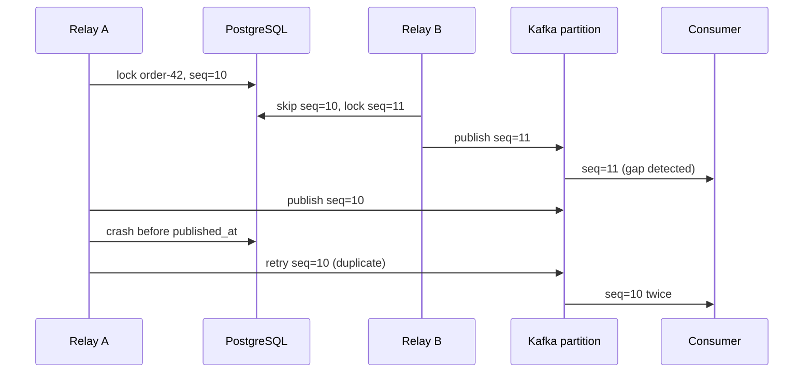

# Transactional outbox ordering with concurrent relays

## Correct answer

a. Publish first; consumers dedupe by event_id and enforce sequence, buffering or retrying gaps.

## Detailed explanation

The database transaction that writes business state and the outbox row makes event creation atomic, but it does not make the later database-to-Kafka relay atomic. There is no single commit covering Kafka's acknowledgement and `published_at` in PostgreSQL.

The safer failure order is publish first, then mark the row as published. If a relay crashes after Kafka acknowledges the record but before the database update commits, the row remains eligible and will be published again. This gives at-least-once delivery rather than silent loss, so every event needs a stable `event_id` and consumers must record processed IDs atomically with their own state changes.

`SKIP LOCKED` adds a separate ordering problem. Relay A can lock sequence 10 for an order and pause. Relay B skips that locked row, claims sequence 11 for the same order, and publishes it first. Although both records use `order_id` as the Kafka key and reach the same partition, Kafka preserves the order in which the broker appends them; it cannot reconstruct the intended database sequence across independent producers.



The consumer therefore keeps the last accepted sequence per aggregate and a deduplication record keyed by `event_id`. On a duplicate it safely acknowledges without applying the effect twice. On a gap it can buffer briefly, retry later, or route the aggregate for reconciliation. The exact policy depends on whether later events can be applied independently and how long missing events may legitimately be delayed.

Sequence checks are a correctness backstop, not a reason to ignore relay design. Systems can reduce reordering by serializing claims per aggregate, partitioning relay ownership by `order_id`, or publishing through a single ordered stream per shard. Those approaches trade throughput and operational complexity for stronger ordering before consumption.

## Code example

```sql
BEGIN;

-- Apply the event and record its stable identity in the same consumer transaction.
INSERT INTO consumed_events (consumer_name, event_id)
VALUES ('billing', :event_id)
ON CONFLICT DO NOTHING;

-- Run only when the INSERT above inserted one row and sequence_no is expected.
UPDATE account_projection
SET balance = :new_balance,
    last_sequence_no = :sequence_no
WHERE order_id = :order_id
  AND last_sequence_no = :sequence_no - 1;

COMMIT;
```

In production, the consumer must check both affected-row counts. A zero-row deduplication insert means the event was already processed. A zero-row projection update for a new event means there is a sequence gap or concurrent processing conflict and the transaction should not commit the deduplication record as though processing succeeded.

## Why the other options are incorrect

- b. Kafka's idempotent producer removes retries within one producer session; it does not deduplicate the same outbox event published by different relay instances or sessions. Ordering is also per partition append order, not database sequence order.
- c. Marking an outbox row sent before Kafka acknowledges it creates a loss window: a crash between those actions leaves an unpublished event that no relay will select again. The Kafka key cannot recover an event that was never published.
- d. A consumer group distributes partitions but does not create a global order. Random keys can place one order's events in different partitions, making their relative processing order even less predictable.
